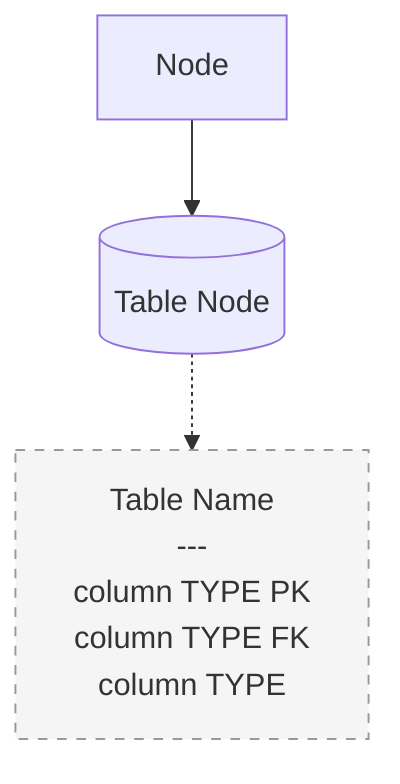

<objective>
Insert a new "## Executive Summary" section into README.md, positioned after the title and the
existing WSL/context7 operational note (original lines 1-4) and before "## 1. Project Objective",
bounded by "---" separators matching the file's existing section-separator convention. The section
has three parts, in order: (A) a 1-2 paragraph project summary sourced from README's own existing
§1 Project Objective content; (B) a concrete, real "row journey" example -- four CSV rows traced
live through this exact deployed platform earlier in this session, through bronze, quarantine,
silver, gold and the lineage view, including an honest caveat about a NULL dbt lineage join; (C)
two collapsible Mermaid architecture diagrams (platform/environment, and data-pipeline/data-layers)
styled after github.com/KonuTech/sql-playgrounds's "Data Pipeline Architecture" pattern -- each a
`<details><summary>` block wrapping a color-coded `classDef`-styled flowchart, a "Data Flow Legend"
and a "Key Relationships" list.

Purpose: give a first-time reader (or Claude, in a fresh session) an accurate, evidence-backed
30-second understanding of what this platform is and proof that its core value claim ("every file,
batch and record can be traced, explained, reprocessed and trusted") is real, not aspirational --
without duplicating or contradicting any of README's existing numbered specification sections.

Output: README.md with a new, self-contained "## Executive Summary" preface section. No other
README.md content is modified; no other files are touched.
</objective>

<execution_context>
@$HOME/.claude/get-shit-done/workflows/execute-plan.md
@$HOME/.claude/get-shit-done/templates/summary.md
</execution_context>

<context>
@.planning/STATE.md
@README.md

<verified_schema_reference>
Real column names, verified directly from the Alembic migrations that define these tables --
use these exact names in the row-journey tables and the Mermaid table-detail nodes. Do not invent
or guess columns.

`staging.customers` (migrations/versions/0022, bronze, owned by CSV Processor, LOGGED/durable):
id, customer_id (TEXT), name (TEXT), country (TEXT), birth_date (TEXT), event_ts (TEXT),
_run_id (BIGINT FK -> meta.ingestion_runs), _file_id (BIGINT FK -> meta.files),
_batch_id (BIGINT FK -> meta.batches), _source_row_number (BIGINT), _record_hash (BYTEA),
_record_hash_version (SMALLINT), _ingested_at (TIMESTAMPTZ). No UNIQUE on customer_id -- bronze is
append-only and allowed cross-run duplicates by design (dedup is silver/dbt's job).

`meta.rejected_records` (migrations/versions/0015, 0020, quarantine): rejected_record_id (PK),
run_id (FK), file_id (FK), batch_id (FK), source_row_number, source_byte_offset, raw_line,
error_type, error_column, error_message, rejected_at, resolution_type (PENDING/REDRIVEN/DISCARDED,
default PENDING), resolved_by_run_id (nullable FK), business_key (TEXT, nullable, added in 0020).

`silver.customers` (migrations/versions/0023, dbt-owned, `ALTER TABLE ... OWNER TO dbt_app`): same
shape as staging.customers plus `_dbt_loaded_at` (TIMESTAMPTZ, nullable, populated by dbt's model
SELECT on every write) and a real `UNIQUE (customer_id)` constraint (`uq_silver_customers_customer_id`).

`normalized.customers` (migrations/versions/0005 + 0006, gold, owned by Python `MergePublisher`):
id, customer_id (INTEGER), name (TEXT), country (TEXT), birth_date (DATE), event_ts (TIMESTAMPTZ),
_run_id/_file_id/_batch_id (FKs), _source_row_number, _record_hash, _record_hash_version,
_ingested_at. `customer_id` carries a real `UNIQUE` constraint (`uq_customers_customer_id`, added by
migration 0006) -- this is the `ON CONFLICT (customer_id)` target `MergePublisher` publishes through.

`meta.dedup_audit` (migrations/versions/0024, dbt-owned, INSERT-only for dbt_app): dedup_audit_id
(PK), dataset_id (FK), dbt_invocation_id (TEXT, dbt's own invocation UUID), model_name,
min_run_id/max_run_id (BIGINT, NOT FKs -- dbt writes these before the referenced runs may be visible
to it), records_received, records_accepted, records_rejected, records_deduplicated, run_at.

`meta.v_customers_lineage` (migrations/versions/0026, a VIEW joining normalized.customers to
meta.ingestion_runs/files/batches/config_versions/schema_versions, then LEFT JOIN silver.customers
ON customer_id match, then LEFT JOIN meta.dedup_audit ON model_name = 'silver_customers' AND
c._run_id BETWEEN da.min_run_id AND da.max_run_id). Exposes: customer_row_id, customer_id,
dag_id, dag_run_id, task_id, k8s_namespace, k8s_pod_name, trace_id, span_id, processor_version,
run_started_at/run_finished_at, config_version, schema_version, silver_loaded_at,
dbt_invocation_id, dbt_run_at, dbt_invocation_records_deduplicated. The `meta.dedup_audit` join is a
RANGE join (`_run_id BETWEEN min_run_id AND max_run_id`), not an equality join -- a gold row whose
covering bronze run predates dbt's first invocation, or whose `_run_id` was never re-stamped by a
later dbt-covered run (e.g. because a replay's `INSERT ... ON CONFLICT DO NOTHING` found identical
content already present and left the ORIGINAL `_run_id` in place), naturally finds no matching range
and returns NULL for `dbt_invocation_id`/`dbt_run_at`. This is exactly the case in the row-journey
example below.

README's existing §2 "Target Architecture" ASCII diagram (for Diagram 1 fidelity) shows, top to
bottom: GitHub -> GitHub Actions -> (Application CI / Infrastructure CI) -> Container Images ->
Local Environment -> Docker -> KIND CLUSTER, which fans out to three boxes -- "Airflow" (Scheduler,
API Server, DAG Proc., Triggerer), "MinIO" (Data Lake, S3 API), and "PostgreSQL Analytical DB"
(staging/bronze, silver/dbt, warehouse/gold) -- plus a "Kubernetes Task Pod" (CSV Processor) fed by
Airflow via "TaskFlow / Kubernetes" and itself connected to MinIO and the Analytical DB, and a
separate "Secrets Manager / HashiCorp Vault" box with "runtime secret access" arrows to Airflow, ETL
Pods and CI/CD. Section 3.1 additionally specifies the kind cluster shape as control-plane +
worker-01 + worker-02. Section 4.1 names the Airflow PostgreSQL instance (metadata only, never the
analytical database). README.md's own text does NOT name Prometheus, Grafana, Tempo or an OTel
Collector anywhere (verified via grep) -- do not add a monitoring-stack node to Diagram 1.
</verified_schema_reference>

<mermaid_style_reference>
Pattern confirmed live from github.com/KonuTech/sql-playgrounds's README "Data Pipeline
Architecture" section. Structure, verbatim shape:

<details>
<summary><strong>Click to expand</strong></summary>



### Data Flow Legend
- **(color swatch) Color (Group name)**: what it represents
- **Solid Lines**: data transformation flow
- **Dotted Lines**: table schema details with PK/FK indicators

### Key Relationships
- bullet list of specific table/column relationships and FK mappings

</details>

Both the "### Data Flow Legend" and "### Key Relationships" sections live INSIDE the `<details>`
block, after the fenced ```mermaid block and before the closing `</details>` tag -- not outside it.
Each of the two diagrams in this plan gets its own complete, independent `<details>...</details>`
block with its own Legend and Key Relationships.
</mermaid_style_reference>
</context>

<tasks>

<task type="auto">
  <name>Task 1: Insert Executive Summary header, project summary, and the row-journey example</name>
  <files>README.md</files>
  <action>
    Locate the insertion point by grepping for the literal string "## 1. Project Objective" in
    README.md -- insert the new content immediately before that line (do not rely on any previously
    reported line number; the file may have drifted). Preserve the file's existing blank-line before
    "---" convention used between its other major sections.

    Insert, in this exact order, starting right after the existing WSL/context7 note and its
    trailing blank line, and ending with the HTML comment placeholder described at the end (do NOT
    add a closing "---" yet -- Task 2 adds it after inserting the diagrams in the same location):

    "---" on its own line, blank line, "## Executive Summary" heading, blank line.

    Part A -- two paragraphs of project summary, sourced strictly from README's own existing
    section 1 "Project Objective" content (no new claims):

    Paragraph 1: This repository is a local, production-like ETL/data platform -- Apache Airflow
    orchestrating containerized ETL workloads on a multi-node kind Kubernetes cluster, backed by
    MinIO as an S3-compatible data lake, two physically separate PostgreSQL instances (Airflow
    metadata vs. an analytical warehouse), and HashiCorp Vault for secrets. Its first workload is a
    metadata-driven universal CSV ingestion engine that discovers, inspects, parses, validates,
    normalizes, deduplicates and transactionally loads real-world messy CSV files, with schema
    evolution, incremental processing, CDC and SCD support.

    Paragraph 2: It is deliberately not an Airflow tutorial, a CSV parser, a bag of scripts, or a
    Docker Compose dev environment -- it is a platform whose architecture lets additional ETL
    workloads be added later without redesign. Its core value: every file, batch and record that
    enters the platform can be traced, explained, reprocessed and trusted -- ingestion is
    idempotent, auditable and replayable, and no data is ever silently dropped, duplicated or
    corrupted. The row-journey example below demonstrates that guarantee end to end, using real
    data traced through this exact deployed platform.

    Blank line, "### A Row's Journey Through the Platform" heading, blank line, one introductory
    sentence: This is not a hypothetical -- it is real data, verified live against this deployed
    platform's databases during this session.

    Blank line, then: "**Raw file:** `s3://raw/customers/e2e-backfill-b0ef04b6c2d2-original.csv`",
    blank line, then a fenced code block using the `csv` language tag containing exactly these five
    lines (header + 4 data rows, no alteration):
    customer_id,name,country,birth_date,event_ts
    2006091645,Anna Kowalski,PL,1950-03-14,2026-01-05T08:15:00Z
    2006091646,James Smith,US,1962-12-25,2026-02-02T05:03:27Z
    2006091647,Sophie Muller,GB,1974-03-19,2026-03-16T22:37:52Z
    2006091648,,PL,1988-12-01,2026-04-13T16:49:05Z

    Blank line, "**1. Bronze -- `staging.customers`**", blank line, a markdown table with header
    row `customer_id | name | country | birth_date | event_ts` containing exactly the first 3 data
    rows above (row 4 excluded -- it never reaches bronze), blank line, then: "All three rows share
    `_file_id = 106045` and `_run_id = 43351` (this file's single ingestion run)."

    Blank line, "**2. Quarantine -- `meta.rejected_records`**", blank line, one sentence: "Row 4
    (`2006091648`) never reaches bronze, silver or gold -- it fails structural validation and is
    quarantined:", blank line, a markdown table with header row `source_row_number | error_type |
    error_column | error_message | resolution_type` containing exactly one data row: `4 |
    COMPLETENESS_VIOLATION | name | required column 'name' is empty | PENDING`.

    Blank line, "**3. Silver -- `silver.customers`** (dbt-owned)", blank line, one sentence: "The
    same 3 accepted rows, deduplicated by dbt's bronze-to-silver model:", blank line, a markdown
    table with header row `customer_id | name | country | birth_date | event_ts | _dbt_loaded_at`
    containing all 3 rows, with `_dbt_loaded_at` = `2026-08-19 08:51:38` in every row.

    Blank line, "**4. Gold -- `normalized.customers`** (Python `MergePublisher`-owned)", blank line,
    one sentence: "The same 3 rows, identical content, published via `INSERT ... ON CONFLICT
    (customer_id)` inside `MergePublisher`'s single transaction -- typed now (`customer_id` integer,
    `birth_date` date, `event_ts` timestamptz) rather than bronze/silver's all-TEXT columns."

    Blank line, "**5. Lineage -- `meta.v_customers_lineage`**", blank line, one sentence: "Resolved
    for `customer_id = 2006091645` via `meta.v_customers_lineage`:", blank line, a markdown table
    with header row `field | value` containing exactly these rows: `dag_id |
    csv_ingest_customers`, `dag_run_id | scheduled__2026-08-17T12:32:00+00:00`, `task_id | ingest`,
    `k8s_pod_name | ingest-95ykverh`, `dbt_invocation_id | NULL`, `dbt_run_at | NULL`.

    Blank line, then a paragraph starting with "**A known, honest nuance:**" explaining plainly
    (not apologetically, not as a bug report) that this row's `dbt_invocation_id`/`dbt_run_at` are
    NULL: gold's `_run_id` column stayed pinned to the ORIGINAL 2026-08-17 ingest run, because
    `MergePublisher` uses `INSERT ... ON CONFLICT DO NOTHING` and found identical content already
    present during a later backfill replay -- so the row was never re-stamped with a newer
    `_run_id`. The lineage view joins `meta.dedup_audit` on a `_run_id BETWEEN min_run_id AND
    max_run_id` range, and no `dedup_audit` row has ever covered that original run's range, since
    it predates dbt's existence in this pipeline. State this as a real, structural consequence of
    how replay and idempotent gold writes interact with the lineage view -- not as a defect that
    has been or needs to be fixed.

    Blank line, then a single HTML comment on its own line: `<!-- EXEC-SUMMARY-DIAGRAMS-PLACEHOLDER -->`
    -- Task 2 replaces this exact comment string with the two Mermaid diagrams plus the closing
    "---" separator.
  </action>
  <verify>
    <automated>cd /home/konutec/projects/airflow-platform && EXEC_LINE=$(grep -n "^## Executive Summary$" README.md | head -1 | cut -d: -f1) && OBJ_LINE=$(grep -n "^## 1\. Project Objective$" README.md | head -1 | cut -d: -f1) && test -n "$EXEC_LINE" && test -n "$OBJ_LINE" && test "$EXEC_LINE" -lt "$OBJ_LINE" && grep -q "2006091645,Anna Kowalski,PL,1950-03-14,2026-01-05T08:15:00Z" README.md && grep -q "2006091648" README.md && grep -q "COMPLETENESS_VIOLATION" README.md && grep -qi "required column 'name' is empty" README.md && grep -q "_dbt_loaded_at" README.md && grep -q "2026-08-19 08:51:38" README.md && grep -q "ingest-95ykverh" README.md && grep -q "scheduled__2026-08-17T12:32:00+00:00" README.md && grep -q "EXEC-SUMMARY-DIAGRAMS-PLACEHOLDER" README.md && grep -qi "dbt_invocation_id" README.md && grep -qi "ON CONFLICT DO NOTHING" README.md && echo PASS || (echo FAIL; exit 1)</automated>
  </verify>
  <done>README.md contains a new "## Executive Summary" heading positioned before "## 1. Project Objective", with a two-paragraph project summary and a fully-populated row-journey narrative (raw CSV, bronze table, quarantine table, silver table, gold description, lineage table, and the honest NULL-lineage nuance paragraph), ending in the diagrams placeholder comment ready for Task 2.</done>
</task>

<task type="auto">
  <name>Task 2: Replace the diagrams placeholder with two collapsible Mermaid architecture diagrams</name>
  <files>README.md</files>
  <action>
    Locate the exact string `<!-- EXEC-SUMMARY-DIAGRAMS-PLACEHOLDER -->` in README.md (inserted by
    Task 1) and replace it with the two diagrams below plus the closing "---" separator, following
    the `<mermaid_style_reference>` structure exactly (Legend and Key Relationships INSIDE each
    `<details>` block, after the mermaid fence, before `</details>`).

    First insert: blank line, "### Platform / Environment Architecture" heading, blank line, then:

    `<details>`
    `<summary><strong>Click to expand</strong></summary>`
    blank line
    a fenced ```mermaid block, `flowchart TD`, containing nodes for exactly (and only) the
    components README.md's own section 2 (Target Architecture), section 3.1 (kind cluster shape)
    and section 4 (PostgreSQL Architecture) already document -- do not invent components not in
    README.md, and do not add a monitoring-stack node since README.md never names
    Prometheus/Grafana/Tempo/OTel anywhere: GitHub -> GitHub Actions -> Container Images -> the kind
    cluster (labelled with its control-plane + worker-01 + worker-02 shape); the kind cluster
    fanning out to the three worker/control-plane nodes; Airflow's four components (API Server,
    Scheduler, DAG Processor, Triggerer) as their own nodes, with the Scheduler connected to a "CSV
    Processor Task Pod" node via a `KubernetesExecutor, dynamic task mapping`-labelled edge; MinIO
    (S3-compatible Data Lake) as its own node; the Airflow PostgreSQL node (metadata only) and the
    Analytical PostgreSQL node as separate nodes, each reached from the cluster; the CSV Processor
    Task Pod connected to both MinIO (reads raw/ bucket) and the Analytical PostgreSQL node (writes
    staging/bronze); HashiCorp Vault as its own node, connected via dotted `-.->` edges labelled
    "runtime secret access" to the API Server, Scheduler, Triggerer and the CSV Processor Task Pod;
    and one dotted-line "table detail" node off the Analytical PostgreSQL node, in the reference
    pattern's schema-snippet style, listing its three real schema layers verbatim: "staging / bronze
    -- owned by CSV Processor", "silver -- owned by dbt (Postgres adapter)", "warehouse / gold --
    owned by Python MergePublisher". End the mermaid block with `classDef` statements defining at
    least five distinct color groups (e.g. ci, k8s, airflow, compute, storage, secrets, details --
    matching the reference's `fill:#hex,stroke:#hex` shape, plus a `details` classDef using
    `fill:#f5f5f5,stroke:#999,stroke-dasharray: 5 5` for the dotted schema-snippet node) and `class`
    statements assigning every node to exactly one group. The mermaid syntax must be valid standard
    flowchart syntax (node shapes like `[Label]`/`[(Label)]`, `-->` solid edges, `-.->` dotted edges,
    `%%` comments if needed) -- no exotic Mermaid extensions.
    blank line
    "### Data Flow Legend" heading, then a bullet list explaining each `classDef` color group used
    (what it represents) plus two bullets for "Solid Lines" (data/control flow) and "Dotted Lines"
    (secret-access relationships and schema/table detail annotations).
    blank line
    "### Key Relationships" heading, then a bullet list covering: how KubernetesExecutor dispatches
    CSV Processor task pods; how Vault delivers runtime secrets to Airflow components and ETL pods
    (no long-lived Kubernetes Secret); why the Airflow PostgreSQL and Analytical PostgreSQL instances
    are physically separate (metadata never mixes with analytical data); and the three-schema-layer
    ownership split inside the Analytical PostgreSQL instance (bronze/CSV Processor, silver/dbt,
    gold/MergePublisher).
    blank line
    `</details>`

    Then insert: blank line, "### Data Pipeline / Data Layers Architecture" heading, blank line,
    then:

    `<details>`
    `<summary><strong>Click to expand</strong></summary>`
    blank line
    a fenced ```mermaid block, `flowchart TD`, containing: a raw-bucket node (`s3://raw/customers/*.csv,
    immutable, append-only`); the real Airflow task chain `discover -> stage -> dbt_build -> publish`
    as four sequential task nodes; from `stage`, a solid edge labelled "valid rows" to a
    `staging.customers / staging.orders` bronze node, and a separate solid edge labelled "invalid
    rows" to a `meta.rejected_records` quarantine node; from the bronze node, a solid edge to
    `dbt_build`; from `dbt_build`, a solid edge labelled "clean, dedup, late-arriving resolution" to
    a `silver.customers / silver.orders` node, and a second solid edge labelled "per-invocation audit
    trail" to a `meta.dedup_audit` node; from the silver node, a solid edge to `publish`; from
    `publish`, a solid edge labelled "MergePublisher: INSERT ... ON CONFLICT" to a
    `normalized.customers / normalized.orders` gold node; dotted edges from the gold node, the
    dedup_audit node and the bronze node converging on a `meta.v_customers_lineage` node. Then add
    dotted "table detail" nodes (exact real column names, from `<verified_schema_reference>` above,
    using PK/FK annotations matching the reference repo's style) off of: the bronze node (staging.
    customers's real columns), the quarantine node (meta.rejected_records's real columns), the
    silver node (silver.customers's real columns including `_dbt_loaded_at` and its UNIQUE
    constraint), the dedup_audit node (meta.dedup_audit's real columns), the gold node
    (normalized.customers's real columns including its UNIQUE constraint), and the lineage node
    (meta.v_customers_lineage's real exposed columns, noting `dbt_invocation_id`/`dbt_run_at` are
    nullable). End with `classDef` statements for at least six distinct color groups (e.g. raw, task,
    bronze, quarantine, silver, gold, meta, details) plus `class` statements assigning every node.
    Valid standard flowchart syntax only, matching the reference's dotted-detail-node convention.
    blank line
    "### Data Flow Legend" heading, then a bullet list explaining each color group (raw storage,
    Airflow tasks, bronze, quarantine, silver, gold, metadata/lineage) plus "Solid Lines" (data
    movement between layers) and "Dotted Lines" (table schema details and lineage resolution).
    blank line
    "### Key Relationships" heading, then a bullet list covering: why quarantined rows never reach
    bronze/silver/gold (structural validation happens in `stage`, before the transactional load);
    that bronze is append-only with no UNIQUE constraint on the business key (dedup is silver/dbt's
    job); that `silver.customers`/`normalized.customers` each carry a real UNIQUE constraint on
    their business key (`customer_id`) supporting dbt's incremental model and MergePublisher's
    `ON CONFLICT` target respectively; and that `meta.v_customers_lineage` joins `meta.dedup_audit`
    via a `_run_id BETWEEN min_run_id AND max_run_id` RANGE (not equality), which is why some gold
    rows can show a NULL `dbt_invocation_id` even though the row itself is fully traceable end to
    end (see the row-journey example above).
    blank line
    `</details>`
    blank line
    "---" on its own line (closing the Executive Summary section, matching the file's existing
    section-separator convention -- "## 1. Project Objective" immediately follows).
  </action>
  <verify>
    <automated>cd /home/konutec/projects/airflow-platform && test "$(grep -c '```mermaid' README.md)" -eq 2 && test "$(grep -c '<details>' README.md)" -eq 2 && test "$(grep -c '</details>' README.md)" -eq 2 && test "$(grep -c '^### Data Flow Legend$' README.md)" -eq 2 && test "$(grep -c '^### Key Relationships$' README.md)" -eq 2 && ! grep -q "EXEC-SUMMARY-DIAGRAMS-PLACEHOLDER" README.md && grep -q "staging.customers" README.md && grep -q "silver.customers" README.md && grep -q "normalized.customers" README.md && grep -q "meta.rejected_records" README.md && grep -q "meta.dedup_audit" README.md && grep -q "meta.v_customers_lineage" README.md && grep -qi "classDef" README.md && test "$(grep -cE '^#{1,2} [0-9]+\.' README.md)" -eq 115 && echo PASS || (echo FAIL; exit 1)</automated>
  </verify>
  <done>The diagrams placeholder is replaced with two independently collapsible Mermaid diagrams (Platform/Environment Architecture; Data Pipeline/Data Layers Architecture), each with color-coded classDef node groups, real table/column detail nodes matching the Alembic-defined schema, a Data Flow Legend and a Key Relationships list inside its own details block, followed by the closing "---" separator. The numbered-header count (115) is unchanged.</done>
</task>

</tasks>

<threat_model>
## Trust Boundaries

| Boundary | Description |
|----------|--------------|
| None introduced | Documentation-only change to README.md. No code, credentials, dependencies, or running system is touched -- no new trust boundary is created. |

## STRIDE Threat Register

| Threat ID | Category | Component | Disposition | Mitigation Plan |
|-----------|----------|-----------|-------------|------------------|
| T-quick-01 | Tampering (informational integrity, not a security control) | New Executive Summary content | accept | The only real risk is the section becoming factually inconsistent with the rest of README.md or with the live database. Mitigated by sourcing every row-journey value and every schema column name directly from the Alembic migrations and this session's live verification (documented in `<verified_schema_reference>`), and by each task's automated verify checking the exact literal values/columns/section-count invariant. |
| T-quick-02 | Repudiation (accepted, informational only) | The row-journey narrative's "known, honest nuance" paragraph | accept | Deliberately documents a real NULL-join edge case rather than hiding it, so a future reader is not misled into thinking `dbt_invocation_id` is always populated. No corrective code change is in scope for this quick task. |
| T-quick-03 | Tampering (accepted, no code path affected) | README.md is prose/documentation, not executable code or a package-manager install target | accept | No new dependency, package install, or external service integration is introduced -- the npm/pip/cargo package-legitimacy gate does not apply. |
</threat_model>

<verification>
1. Task 1's automated grep checks pass: the Executive Summary heading exists before section 1, and every real row-journey value (raw CSV rows, bronze `_file_id`/`_run_id`, quarantine error detail, silver `_dbt_loaded_at`, lineage `dag_id`/`dag_run_id`/`task_id`/`k8s_pod_name`, and the NULL-lineage nuance) is present verbatim.
2. Task 2's automated grep checks pass: exactly 2 `<details>`/`</details>` pairs, 2 mermaid fences, 2 "Data Flow Legend" and 2 "Key Relationships" headings, the placeholder comment is gone, real table/column names appear, and the numbered-header count (`^#{1,2} [0-9]+\.`) is unchanged at 115.
3. `git diff --stat README.md` shows only README.md changed; no other file (PROJECT.md, ROADMAP.md, STATE.md, migrations) is touched by this quick task.
4. Manual skim confirms the new section reads as a coherent preface (Part A summary, then Part B row journey, then Part C diagrams) and does not duplicate or contradict any existing numbered section's content.
</verification>

<success_criteria>
- README.md has a new "## Executive Summary" section between the title/WSL note and "## 1. Project Objective", bounded by "---" separators matching the file's existing convention.
- The section's project summary is sourced from README's own section 1 with no invented claims.
- The row-journey example uses only real, verified values and real Alembic-defined column names, and honestly documents the NULL `dbt_invocation_id`/`dbt_run_at` lineage-join nuance as a structural consequence, not a bug.
- Both Mermaid diagrams render with standard flowchart syntax, are independently collapsible via `<details>`, use color-coded `classDef` node groups matching the KonuTech/sql-playgrounds pattern, and each carries its own Data Flow Legend and Key Relationships list.
- Zero existing README.md content, numbering, or section count is altered.
</success_criteria>

<output>
Create `.planning/quick/260819-hsw-add-executive-summary-with-row-journey-e/260819-hsw-SUMMARY.md` when done
</output>
