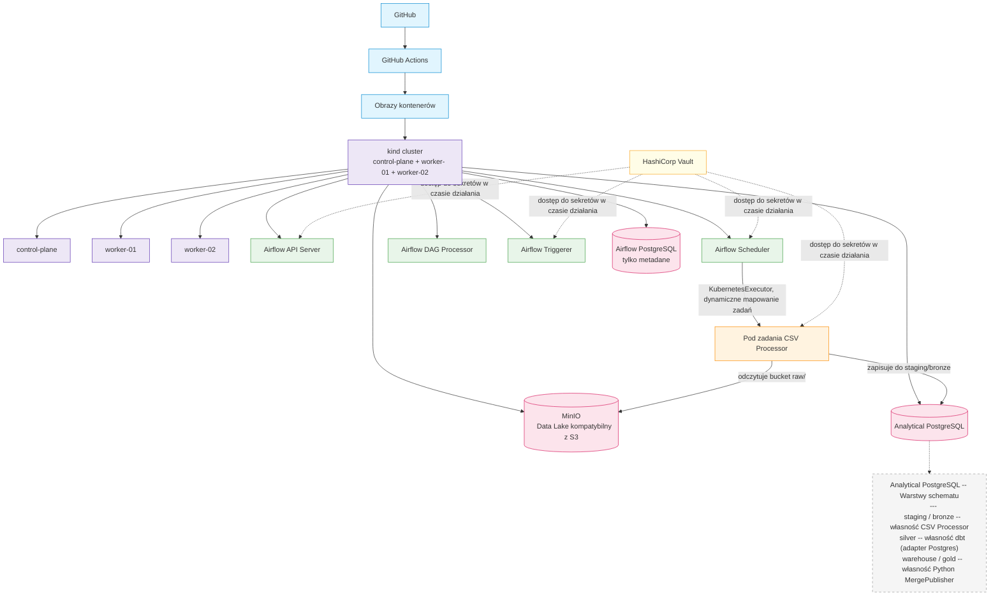
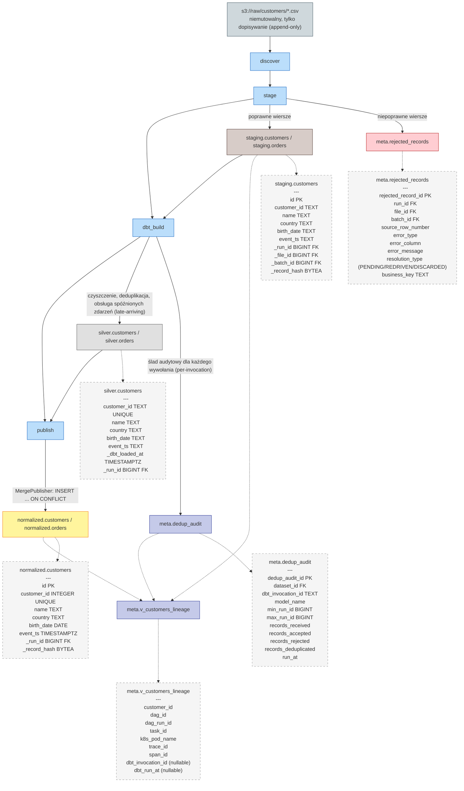

<objective>
Restructure the top of README.md: (1) delete the H1 title line and its two operational-note lines
entirely (they are not preserved anywhere else), removing the now-orphaned leading "---" separator
so the file starts directly with "## Executive Summary"; (2) wrap the entire pre-existing Executive
Summary content in an open-by-default "🇬🇧 English" `<details>` block; (3) add a closed-by-default
"🇵🇱 Polski" `<details>` block right after it, containing a full and correctly-scoped Polish
translation of the same content.

Purpose: make README.md immediately usable by a Polish-speaking reader without duplicating the
title/operational-note lines (which belong to no specific language and are simply removed) and
without disturbing any of the file's existing numbered specification sections.

Output: README.md with a restructured top -- no title block, EN/PL language-tab Executive Summary,
section 1 onward completely unchanged.
</objective>

<execution_context>
@$HOME/.claude/get-shit-done/workflows/execute-plan.md
@$HOME/.claude/get-shit-done/templates/summary.md
</execution_context>

<context>
@.planning/STATE.md
@README.md

<top_edit>
Exact literal text to locate and replace at the very start of README.md (this is the ONLY place
this text occurs -- safe as a unique Edit anchor).

old_string (verbatim, including blank lines -- this is currently lines 1-9 of README.md):
# Production-Like Local Kubernetes Airflow ETL Platform

When installing tools use the most recent and stable versions.
I am on WSL. Whenver in need of checking for latest documentation use MCP context7 which is already installed and available.

---

## Executive Summary


new_string (verbatim -- removes the title/notes/separator, keeps the heading, opens the English
details wrapper immediately after it; the very next line of the file, "This repository is a local,
production-like ETL/data platform...", follows unchanged immediately after this new_string):
## Executive Summary

<details open>
<summary><strong>🇬🇧 English</strong></summary>

</top_edit>

<bottom_edit_task1>
Exact literal text to locate and replace near the end of the pre-existing Executive Summary content
(currently lines 308-314 of README.md -- unique due to the adjacent "# 1. Project Objective"
anchor, which appears exactly once in the file).

old_string (verbatim):
</details>

---

# 1. Project Objective

new_string (verbatim -- adds one more closing `</details>` tag, closing the English wrapper opened
by the top_edit above; the original "---" separator and "# 1. Project Objective" onward are
otherwise untouched):
</details>

</details>

---

# 1. Project Objective
</bottom_edit_task1>

<polish_content>
The complete Polish translation block for Task 2. This is inserted between the two `</details>`
tags produced by Task 1 (English wrapper close) and the original "---" separator, i.e. Task 2's
Edit anchor is the same text bottom_edit_task1 produced:

old_string (verbatim, the exact result of Task 1's second edit):
</details>

</details>

---

# 1. Project Objective

new_string: the same text, but with the full Polish `<details>` block inserted between the second
`</details>` and the "---" line. The exact Polish block to insert (verbatim, including the Mermaid
code fences -- every identifier, column name, table name, product name and Mermaid node ID below is
intentionally left in English per the task's translation rules) is:

<details>
<summary><strong>🇵🇱 Polski</strong></summary>

To repozytorium to lokalna, zbliżona do produkcyjnej platforma ETL/danych -- Apache Airflow
orkiestrujący konteneryzowane obciążenia ETL na wielowęzłowym klastrze Kubernetes kind, wspierany
przez MinIO jako magazyn danych kompatybilny z S3, dwie fizycznie oddzielone instancje PostgreSQL
(metadane Airflow vs. analityczna hurtownia danych) oraz HashiCorp Vault do zarządzania sekretami.
Jej pierwszym obciążeniem jest sterowany metadanymi, uniwersalny silnik ingestii plików CSV, który
odkrywa, inspekcjonuje, parsuje, waliduje, normalizuje, deduplikuje i transakcyjnie ładuje
rzeczywiste, "brudne" pliki CSV, z obsługą ewolucji schematu, przetwarzania przyrostowego, CDC i
SCD.

To celowo nie jest samouczek Airflow, parser CSV, zbiór luźnych skryptów ani środowisko
deweloperskie oparte na Docker Compose -- to platforma, której architektura pozwala na dodawanie
kolejnych obciążeń ETL w przyszłości bez przeprojektowywania. Jej kluczowa wartość: każdy plik,
batch i rekord, który trafia do platformy, może zostać prześledzony, wyjaśniony, ponownie
przetworzony i można mu zaufać -- ingestia jest idempotentna, audytowalna i powtarzalna
(replayable), a żadne dane nigdy nie są po cichu odrzucane, duplikowane ani uszkadzane. Poniższy
przykład podróży wiersza (row-journey) demonstruje tę gwarancję od początku do końca, wykorzystując
rzeczywiste dane prześledzone przez tę dokładnie wdrożoną platformę.

### Podróż wiersza przez platformę

To nie jest hipotetyczny przykład -- to rzeczywiste dane, zweryfikowane na żywo względem baz danych
tej wdrożonej platformy w trakcie tej sesji.

**Plik surowy (raw):** `s3://raw/customers/e2e-backfill-b0ef04b6c2d2-original.csv`

```csv
customer_id,name,country,birth_date,event_ts
2006091645,Anna Kowalski,PL,1950-03-14,2026-01-05T08:15:00Z
2006091646,James Smith,US,1962-12-25,2026-02-02T05:03:27Z
2006091647,Sophie Muller,GB,1974-03-19,2026-03-16T22:37:52Z
2006091648,,PL,1988-12-01,2026-04-13T16:49:05Z
```

**1. Bronze -- `staging.customers`**

| customer_id | name | country | birth_date | event_ts |
|---|---|---|---|---|
| 2006091645 | Anna Kowalski | PL | 1950-03-14 | 2026-01-05T08:15:00Z |
| 2006091646 | James Smith | US | 1962-12-25 | 2026-02-02T05:03:27Z |
| 2006091647 | Sophie Muller | GB | 1974-03-19 | 2026-03-16T22:37:52Z |

Wszystkie trzy wiersze mają wspólne `_file_id = 106045` oraz `_run_id = 43351` (pojedynczy run
ingestii tego pliku).

**2. Kwarantanna -- `meta.rejected_records`**

Wiersz 4 (`2006091648`) nigdy nie dociera do bronze, silver ani gold -- nie przechodzi walidacji
strukturalnej i trafia do kwarantanny:

| source_row_number | error_type | error_column | error_message | resolution_type |
|---|---|---|---|---|
| 4 | COMPLETENESS_VIOLATION | name | required column 'name' is empty | PENDING |

**3. Silver -- `silver.customers`** (własność dbt)

Te same 3 zaakceptowane wiersze, zdeduplikowane przez model dbt bronze-to-silver:

| customer_id | name | country | birth_date | event_ts | _dbt_loaded_at |
|---|---|---|---|---|---|
| 2006091645 | Anna Kowalski | PL | 1950-03-14 | 2026-01-05T08:15:00Z | 2026-08-19 08:51:38 |
| 2006091646 | James Smith | US | 1962-12-25 | 2026-02-02T05:03:27Z | 2026-08-19 08:51:38 |
| 2006091647 | Sophie Muller | GB | 1974-03-19 | 2026-03-16T22:37:52Z | 2026-08-19 08:51:38 |

**4. Gold -- `normalized.customers`** (własność Python `MergePublisher`)

Te same 3 wiersze, o identycznej zawartości, opublikowane za pomocą `INSERT ... ON CONFLICT
(customer_id)` w ramach pojedynczej transakcji `MergePublisher` -- tym razem otypowane
(`customer_id` integer, `birth_date` date, `event_ts` timestamptz), a nie jak w bronze/silver,
gdzie wszystkie kolumny są typu TEXT.

**5. Lineage -- `meta.v_customers_lineage`**

Rozwiązane dla `customer_id = 2006091645` za pomocą `meta.v_customers_lineage`:

| field | value |
|---|---|
| dag_id | csv_ingest_customers |
| dag_run_id | scheduled__2026-08-17T12:32:00+00:00 |
| task_id | ingest |
| k8s_pod_name | ingest-95ykverh |
| dbt_invocation_id | NULL |
| dbt_run_at | NULL |

**Znany, uczciwie opisany niuans:** `dbt_invocation_id`/`dbt_run_at` tego wiersza mają wartość
NULL, ponieważ kolumna `_run_id` w gold pozostała przypięta do ORYGINALNEGO runu ingestii z
2026-08-17 -- `MergePublisher` używa `INSERT ... ON CONFLICT DO NOTHING` i podczas późniejszego
replayu backfillu znalazł już obecną identyczną zawartość, więc wiersz nigdy nie został ponownie
oznaczony nowszym `_run_id`. Widok lineage łączy się z `meta.dedup_audit` po zakresie `_run_id
BETWEEN min_run_id AND max_run_id`, a żaden wiersz `dedup_audit` nigdy nie obejmował zakresu tego
oryginalnego runu, ponieważ poprzedza on istnienie dbt w tym pipeline. Jest to realna, strukturalna
konsekwencja tego, jak replay i idempotentne zapisy do gold wchodzą w interakcję z widokiem
lineage -- a nie defekt, który został lub musi zostać naprawiony.

### Architektura platformy / środowiska

<details>
<summary><strong>Kliknij, aby rozwinąć</strong></summary>



### Legenda przepływu danych
- **(niebieski) CI/CD**: GitHub, GitHub Actions oraz obrazy kontenerów zasilające klaster
- **(fioletowy) Kubernetes**: klaster kind oraz jego węzły control-plane/worker-01/worker-02
- **(zielony) Airflow**: cztery wymagane komponenty Airflow 3 (API Server, Scheduler, DAG Processor, Triggerer)
- **(pomarańczowy) Compute**: efemeryczny Pod zadania CSV Processor uruchamiany przez KubernetesExecutor
- **(różowy) Storage**: MinIO (Data Lake kompatybilny z S3) oraz dwie instancje PostgreSQL
- **(żółty) Secrets**: HashiCorp Vault
- **Linie ciągłe**: przepływ budowania CI/CD, rozgałęzienie Kubernetes oraz przepływ danych/sterowania między komponentami
- **Linie kropkowane**: relacje dostępu do sekretów w czasie działania Vault oraz adnotacja ze szczegółami warstw schematu Analytical PostgreSQL

### Kluczowe relacje
- KubernetesExecutor (działający wewnątrz procesu Scheduler) uruchamia każde zadanie CSV Processor jako osobny, efemeryczny pod Kubernetes za pomocą dynamicznego mapowania zadań -- bez długo działających workerów Celery
- Vault dostarcza sekrety w czasie działania bezpośrednio do API Server, Schedulera, Triggerera oraz Poda zadania CSV Processor poprzez logowanie SA-token z uwierzytelnianiem Kubernetes -- żaden długo istniejący Kubernetes Secret nigdy nie przechowuje poświadczeń
- Airflow PostgreSQL i Analytical PostgreSQL to fizycznie oddzielone wdrożenia -- metadane Airflow nigdy nie mieszają się z danymi analitycznymi, mimo że oba działają wewnątrz tego samego klastra kind
- Wewnątrz Analytical PostgreSQL trzy warstwy schematu mają odrębnych właścicieli: staging/bronze (CSV Processor), silver (adapter Postgres dbt), warehouse/gold (Python MergePublisher)

</details>

### Architektura pipeline'u danych / warstw danych

<details>
<summary><strong>Kliknij, aby rozwinąć</strong></summary>



### Legenda przepływu danych
- **(niebiesko-szary) Raw Storage**: niemutowalny bucket `s3://raw/` z zasadą append-only -- jedyny punkt wejścia dla nowych plików
- **(niebieski) Zadania Airflow**: cztery sekwencyjne zadania DAG (`discover`, `stage`, `dbt_build`, `publish`) orkiestrujące pipeline
- **(brązowy) Bronze**: `staging.customers`/`staging.orders`, tabele lądowania danych surowych typu append-only
- **(czerwony) Kwarantanna**: `meta.rejected_records`, wiersze, które nie przeszły walidacji strukturalnej
- **(szary) Silver**: `silver.customers`/`silver.orders`, oczyszczone i zdeduplikowane tabele dbt
- **(żółty) Gold**: `normalized.customers`/`normalized.orders`, gotowe biznesowo tabele hurtowni danych
- **(indygo) Metadane / Lineage**: `meta.dedup_audit` oraz `meta.v_customers_lineage`
- **Linie ciągłe**: przepływ danych między warstwami (stage -> bronze/kwarantanna, bronze -> dbt_build, dbt_build -> silver/dedup_audit, silver -> publish, publish -> gold)
- **Linie kropkowane**: szczegóły schematu tabel (adnotacje PK/FK) oraz złączenia rozwiązujące lineage, zbiegające się w `meta.v_customers_lineage`

### Kluczowe relacje
- Wiersze w kwarantannie nigdy nie docierają do bronze, silver ani gold -- walidacja strukturalna odbywa się w `stage`, przed jakimkolwiek ładowaniem transakcyjnym, więc wiersz jest albo w pełni zaakceptowany do bronze, albo w pełni odrzucony do `meta.rejected_records`
- Bronze (`staging.customers`) działa w trybie append-only bez ograniczenia UNIQUE na `customer_id` -- duplikaty między runami są dopuszczone celowo; deduplikacja to zadanie silver/dbt
- `silver.customers` oraz `normalized.customers` mają rzeczywiste ograniczenie UNIQUE na swoim kluczu biznesowym (`customer_id`), wspierające odpowiednio model przyrostowy dbt oraz cel `ON CONFLICT (customer_id)` dla MergePublisher
- `meta.v_customers_lineage` łączy się z `meta.dedup_audit` za pomocą ZAKRESU `_run_id BETWEEN min_run_id AND max_run_id`, a nie złączenia po równości -- dlatego niektóre wiersze gold mogą pokazywać NULL w `dbt_invocation_id`, mimo że sam wiersz jest w pełni identyfikowalny od początku do końca (zob. przykład podróży wiersza powyżej)

</details>
</polish_content>
</context>

<tasks>

<task type="auto">
  <name>Task 1: Remove title/operational-note block and wrap the existing content in an English details tab</name>
  <files>README.md</files>
  <action>
    Apply two Edit operations to README.md using the exact anchors given in the top_edit and
    bottom_edit_task1 blocks above.

    First edit (top of file): replace the old_string from top_edit (the H1 title line, the two
    operational-note lines beneath it, the blank lines around them, and the now-orphaned leading
    "---" separator, up through and including the "## Executive Summary" heading and its trailing
    blank line) with the new_string from top_edit (the bare "## Executive Summary" heading followed
    by the opening details-open/summary-English tags and a trailing blank line). Do not alter
    anything after this point in the same edit -- the next line, "This repository is a local,
    production-like ETL/data platform...", must follow completely unchanged.

    Second edit (bottom of the existing Executive Summary content): replace the old_string from
    bottom_edit_task1 (the single closing details tag that currently closes the second Mermaid
    diagram's "Click to expand" wrapper, followed by the blank line, "---" separator, blank line,
    and "# 1. Project Objective" heading) with the new_string from bottom_edit_task1 (the same
    closing details tag, followed by a second closing details tag that closes the English wrapper
    opened by the first edit, then the unchanged "---" separator and "# 1. Project Objective"
    heading).

    After both edits, the file must read, from the top: "## Executive Summary", blank line, the
    details-open/English-summary opening tags, blank line, then the entire pre-existing Executive
    Summary content completely unchanged, ending in a closing details tag (diagram wrapper close)
    immediately followed by a second closing details tag (English wrapper close), blank line, "---",
    blank line, "# 1. Project Objective" onward completely unchanged.
  </action>
  <verify>
    <automated>cd /home/konutec/projects/airflow-platform && test "$(sed -n '1p' README.md)" = "## Executive Summary" && ! grep -q "Production-Like Local Kubernetes Airflow ETL Platform" README.md && ! grep -q "When installing tools use the most recent" README.md && ! grep -q "Whenver in need of checking for latest documentation" README.md && test "$(grep -c '<details open>' README.md)" -eq 1 && test "$(grep -c '🇬🇧 English' README.md)" -eq 1 && diff <(git show HEAD:README.md | sed -n '/resembles a real production deployment of Apache Airflow/,$p') <(sed -n '/resembles a real production deployment of Apache Airflow/,$p' README.md) > /dev/null && echo PASS || (echo FAIL; exit 1)</automated>
  </verify>
  <done>README.md's first line is "## Executive Summary" with no title/operational-note lines and no stray leading separator above it; the pre-existing content is now wrapped in an open-by-default English details block whose closing tag sits immediately before the section's original "---" separator; everything from "# 1. Project Objective" onward is byte-for-byte unchanged.</done>
</task>

<task type="auto">
  <name>Task 2: Insert the Polish translation details block</name>
  <files>README.md</files>
  <action>
    Locate the exact anchor text now present in README.md following Task 1: a closing details tag
    (English wrapper close), a blank line, "---", a blank line, and "# 1. Project Objective". Using
    the Edit tool, insert the complete Polish details block given verbatim in the polish_content
    context block above, placed between the English wrapper's closing details tag and the "---"
    separator (i.e. the Polish block becomes the new content immediately preceding "---", and the
    "---"/"# 1. Project Objective" lines remain otherwise untouched).

    Insert the Polish block exactly as given in polish_content -- do not paraphrase, re-translate,
    or alter any of its text, tables, Mermaid diagrams, classDef statements, or node IDs. The block
    starts with `<details>` / `<summary><strong>🇵🇱 Polski</strong></summary>` and ends with its own
    closing `</details>` tag, mirroring the English block's structure (two paragraphs of project
    summary, "### Podróż wiersza przez platformę" row-journey section with the unmodified CSV code
    block and tables, both Mermaid diagrams each inside their own "Kliknij, aby rozwinąć" details
    wrapper with a "### Legenda przepływu danych" and "### Kluczowe relacje" section).
  </action>
  <verify>
    <automated>cd /home/konutec/projects/airflow-platform && test "$(grep -c '🇵🇱 Polski' README.md)" -eq 1 && test "$(grep -c '<details' README.md)" -eq 6 && test "$(grep -c '</details>' README.md)" -eq 6 && test "$(grep -c '```mermaid' README.md)" -eq 4 && test "$(grep -c '^### Data Flow Legend$' README.md)" -eq 2 && test "$(grep -c '^### Legenda przepływu danych$' README.md)" -eq 2 && test "$(grep -c '^### Key Relationships$' README.md)" -eq 2 && test "$(grep -c '^### Kluczowe relacje$' README.md)" -eq 2 && grep -q "ANPGDETAIL\[" README.md && grep -q "COMPLETENESS_VIOLATION" README.md && diff <(git show HEAD:README.md | sed -n '/resembles a real production deployment of Apache Airflow/,$p') <(sed -n '/resembles a real production deployment of Apache Airflow/,$p' README.md) > /dev/null && echo PASS || (echo FAIL; exit 1)</automated>
  </verify>
  <done>README.md contains a closed-by-default "🇵🇱 Polski" details block immediately after the English block and before the section's closing "---", with the full Polish translation (project summary, row-journey narrative, both duplicated Mermaid diagrams with translated legends/key-relationships and identical node IDs/classDef groups). Section 1 onward remains untouched.</done>
</task>

<task type="auto">
  <name>Task 3: Verify structural integrity of the restructured top-of-file</name>
  <files>README.md</files>
  <action>
    Run a final structural check across the whole file to confirm the restructuring is complete and
    nothing else drifted. Confirm: (1) the file starts with "## Executive Summary" and has no H1
    title or operational-note text anywhere; (2) fenced code-block markers are balanced (an even
    total count of lines starting with three backticks); (3) exactly one occurrence each of
    "🇬🇧 English" and "🇵🇱 Polski"; (4) exactly 6 opening and 6 closing details tags, and exactly 4
    mermaid fences; (5) the numbered-header count (lines matching a leading "#" or "##" followed by
    a number and a period) is unchanged from before this task; (6) `git diff --stat README.md` shows
    only README.md changed and no other tracked file was touched by this quick task.
  </action>
  <verify>
    <automated>cd /home/konutec/projects/airflow-platform && test "$(( $(grep -cE '^```' README.md) % 2 ))" -eq 0 && test "$(grep -cE '^#{1,2} [0-9]+\.' README.md)" -eq 115 && test "$(git diff --name-only -- . | grep -v '^\.planning/' | wc -l)" -eq 1 && git diff --name-only -- . | grep -v '^\.planning/' | grep -qx "README.md" && echo PASS || (echo FAIL; exit 1)</automated>
  </verify>
  <done>README.md's restructured top passes every structural check: balanced code fences, exactly one English and one Polish language tab, 6/6 balanced details tags, 4 mermaid diagrams, an unchanged numbered-header count of 115, and README.md is the only tracked file modified by this quick task.</done>
</task>

</tasks>

<threat_model>
## Trust Boundaries

| Boundary | Description |
|----------|--------------|
| None introduced | Documentation-only restructuring of README.md. No code, credentials, dependencies, or running system is touched -- no new trust boundary is created. |

## STRIDE Threat Register

| Threat ID | Category | Component | Disposition | Mitigation Plan |
|-----------|----------|-----------|-------------|------------------|
| T-quick-01 | Tampering (informational integrity, not a security control) | Polish translation content | accept | The only real risk is a translation error or an accidental change to a literal data value/identifier while translating. Mitigated by providing the exact, pre-written Polish text verbatim in the plan's polish_content context block (no paraphrasing left to the executor) and by Task 2/3's automated grep checks confirming literal identifiers (ANPGDETAIL, COMPLETENESS_VIOLATION, table/column names) survived unchanged. |
| T-quick-02 | Tampering (accepted, scope-boundary risk) | Rest of README.md (section 1 onward) | accept | Both Edit anchors are narrowly scoped to the top-of-file title block and the Executive Summary's closing boundary; every task's automated verify includes a `diff` against `git show HEAD:README.md` for everything from "# 1. Project Objective" onward, so any accidental drift outside scope fails the task immediately. |
| T-quick-03 | Tampering (accepted, no code path affected) | README.md is prose/documentation, not executable code or a package-manager install target | accept | No new dependency, package install, or external service integration is introduced -- the npm/pip/cargo package-legitimacy gate does not apply. |
</threat_model>

<verification>
1. Task 1's automated checks pass: file starts with "## Executive Summary", no title/operational-note text remains, exactly one open English details tab exists, and section 1 onward is byte-identical to before.
2. Task 2's automated checks pass: exactly one Polish details tab exists, 6/6 details tags balance, 4 mermaid fences total, 2 English + 2 Polish "Data Flow Legend"/"Key Relationships" headings, and section 1 onward remains byte-identical.
3. Task 3's automated checks pass: balanced code fences, unchanged numbered-header count (115), and `git diff --stat` shows only README.md changed.
4. Manual skim confirms both language tabs render as independently collapsible GitHub `<details>` blocks, the Polish diagrams are structurally identical to the English ones (same nodes/edges/classDef groups), and no content was lost or duplicated incorrectly.
</verification>

<success_criteria>
- README.md's first line is "## Executive Summary" -- no H1 title, no operational-note lines, no stray leading "---" separator.
- The full pre-existing Executive Summary content is preserved unchanged inside an open-by-default "🇬🇧 English" details block.
- A closed-by-default "🇵🇱 Polski" details block immediately follows, containing a complete and correctly-scoped Polish translation (narrative translated; identifiers, literal data values, and product names preserved).
- Both Mermaid diagrams are functionally duplicated across both language blocks with identical node IDs and classDef groups.
- Everything from "# 1. Project Objective" onward, and every other file in the repository, is untouched.
</success_criteria>

<output>
Create `.planning/quick/260819-inq-restructure-readme-md-top-remove-title-o/260819-inq-SUMMARY.md` when done
</output>
