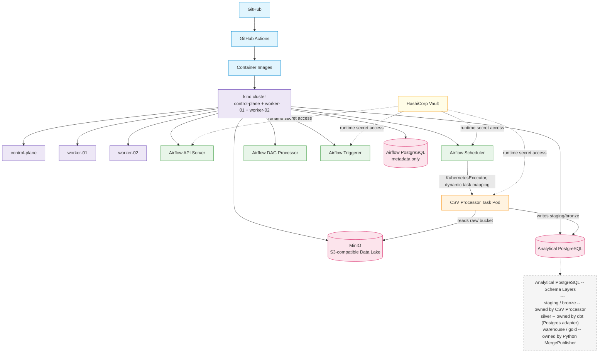
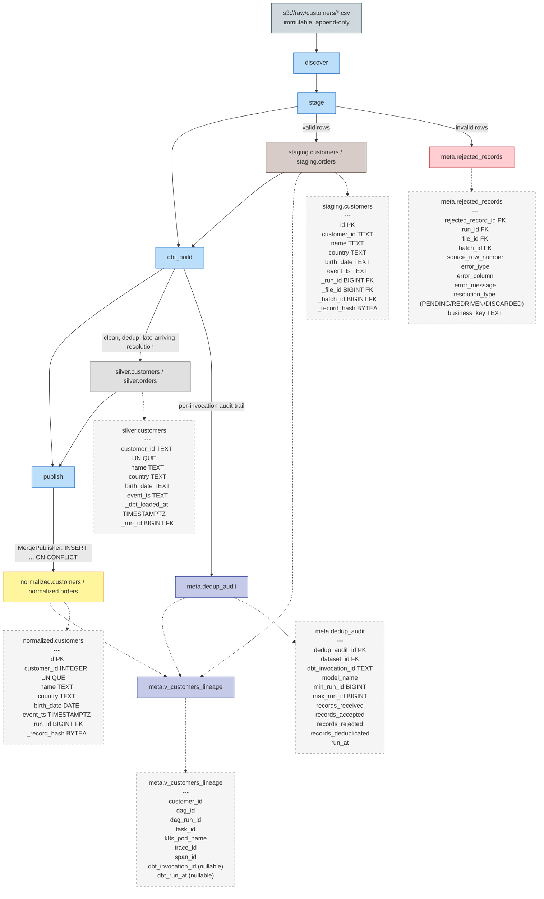

# Production-Like Local Kubernetes Airflow ETL Platform

When installing tools use the most recent and stable versions.
I am on WSL. Whenver in need of checking for latest documentation use MCP context7 which is already installed and available.

---

## Executive Summary

This repository is a local, production-like ETL/data platform -- Apache Airflow orchestrating
containerized ETL workloads on a multi-node kind Kubernetes cluster, backed by MinIO as an
S3-compatible data lake, two physically separate PostgreSQL instances (Airflow metadata vs. an
analytical warehouse), and HashiCorp Vault for secrets. Its first workload is a metadata-driven
universal CSV ingestion engine that discovers, inspects, parses, validates, normalizes,
deduplicates and transactionally loads real-world messy CSV files, with schema evolution,
incremental processing, CDC and SCD support.

It is deliberately not an Airflow tutorial, a CSV parser, a bag of scripts, or a Docker Compose
dev environment -- it is a platform whose architecture lets additional ETL workloads be added
later without redesign. Its core value: every file, batch and record that enters the platform can
be traced, explained, reprocessed and trusted -- ingestion is idempotent, auditable and
replayable, and no data is ever silently dropped, duplicated or corrupted. The row-journey example
below demonstrates that guarantee end to end, using real data traced through this exact deployed
platform.

### A Row's Journey Through the Platform

This is not a hypothetical -- it is real data, verified live against this deployed platform's
databases during this session.

**Raw file:** `s3://raw/customers/e2e-backfill-b0ef04b6c2d2-original.csv`

```csv
customer_id,name,country,birth_date,event_ts
2006091645,Anna Kowalski,PL,1950-03-14,2026-01-05T08:15:00Z
2006091646,James Smith,US,1962-12-25,2026-02-02T05:03:27Z
2006091647,Sophie Muller,GB,1974-03-19,2026-03-16T22:37:52Z
2006091648,,PL,1988-12-01,2026-04-13T16:49:05Z
```

**1. Bronze -- `staging.customers`**

| customer_id | name | country | birth_date | event_ts |
|---|---|---|---|---|
| 2006091645 | Anna Kowalski | PL | 1950-03-14 | 2026-01-05T08:15:00Z |
| 2006091646 | James Smith | US | 1962-12-25 | 2026-02-02T05:03:27Z |
| 2006091647 | Sophie Muller | GB | 1974-03-19 | 2026-03-16T22:37:52Z |

All three rows share `_file_id = 106045` and `_run_id = 43351` (this file's single ingestion run).

**2. Quarantine -- `meta.rejected_records`**

Row 4 (`2006091648`) never reaches bronze, silver or gold -- it fails structural validation and is
quarantined:

| source_row_number | error_type | error_column | error_message | resolution_type |
|---|---|---|---|---|
| 4 | COMPLETENESS_VIOLATION | name | required column 'name' is empty | PENDING |

**3. Silver -- `silver.customers`** (dbt-owned)

The same 3 accepted rows, deduplicated by dbt's bronze-to-silver model:

| customer_id | name | country | birth_date | event_ts | _dbt_loaded_at |
|---|---|---|---|---|---|
| 2006091645 | Anna Kowalski | PL | 1950-03-14 | 2026-01-05T08:15:00Z | 2026-08-19 08:51:38 |
| 2006091646 | James Smith | US | 1962-12-25 | 2026-02-02T05:03:27Z | 2026-08-19 08:51:38 |
| 2006091647 | Sophie Muller | GB | 1974-03-19 | 2026-03-16T22:37:52Z | 2026-08-19 08:51:38 |

**4. Gold -- `normalized.customers`** (Python `MergePublisher`-owned)

The same 3 rows, identical content, published via `INSERT ... ON CONFLICT (customer_id)` inside
`MergePublisher`'s single transaction -- typed now (`customer_id` integer, `birth_date` date,
`event_ts` timestamptz) rather than bronze/silver's all-TEXT columns.

**5. Lineage -- `meta.v_customers_lineage`**

Resolved for `customer_id = 2006091645` via `meta.v_customers_lineage`:

| field | value |
|---|---|
| dag_id | csv_ingest_customers |
| dag_run_id | scheduled__2026-08-17T12:32:00+00:00 |
| task_id | ingest |
| k8s_pod_name | ingest-95ykverh |
| dbt_invocation_id | NULL |
| dbt_run_at | NULL |

**A known, honest nuance:** this row's `dbt_invocation_id`/`dbt_run_at` are NULL because gold's
`_run_id` column stayed pinned to the ORIGINAL 2026-08-17 ingest run -- `MergePublisher` uses
`INSERT ... ON CONFLICT DO NOTHING` and found identical content already present during a later
backfill replay, so the row was never re-stamped with a newer `_run_id`. The lineage view joins
`meta.dedup_audit` on a `_run_id BETWEEN min_run_id AND max_run_id` range, and no `dedup_audit` row
has ever covered that original run's range, since it predates dbt's existence in this pipeline.
This is a real, structural consequence of how replay and idempotent gold writes interact with the
lineage view -- not a defect that has been or needs to be fixed.

### Platform / Environment Architecture

<details>
<summary><strong>Click to expand</strong></summary>



### Data Flow Legend
- **(blue) CI/CD**: GitHub, GitHub Actions and the Container Images that feed the cluster
- **(purple) Kubernetes**: the kind cluster and its control-plane/worker-01/worker-02 nodes
- **(green) Airflow**: the four required Airflow 3 components (API Server, Scheduler, DAG Processor, Triggerer)
- **(orange) Compute**: the ephemeral CSV Processor Task Pod launched by KubernetesExecutor
- **(pink) Storage**: MinIO (S3-compatible data lake) and the two PostgreSQL instances
- **(yellow) Secrets**: HashiCorp Vault
- **Solid Lines**: CI/CD build flow, Kubernetes fan-out, and data/control flow between components
- **Dotted Lines**: Vault's runtime secret-access relationships and the Analytical PostgreSQL schema-layer detail annotation

### Key Relationships
- KubernetesExecutor (running inside the Scheduler process) dispatches each CSV Processor task as its own ephemeral Kubernetes pod via dynamic task mapping -- no long-running Celery workers
- Vault delivers runtime secrets directly to the API Server, Scheduler, Triggerer and CSV Processor Task Pod via Kubernetes-auth SA-token login -- no long-lived Kubernetes Secret ever holds the credential
- Airflow PostgreSQL and Analytical PostgreSQL are physically separate deployments -- Airflow metadata never mixes with analytical data, even though both run inside the same kind cluster
- Inside Analytical PostgreSQL, three schema layers have distinct owners: staging/bronze (CSV Processor), silver (dbt's Postgres adapter), warehouse/gold (Python MergePublisher)

</details>

### Data Pipeline / Data Layers Architecture

<details>
<summary><strong>Click to expand</strong></summary>



### Data Flow Legend
- **(blue-grey) Raw Storage**: the immutable, append-only `s3://raw/` bucket -- the sole entry point for new files
- **(blue) Airflow Tasks**: the four sequential DAG tasks (`discover`, `stage`, `dbt_build`, `publish`) that orchestrate the pipeline
- **(brown) Bronze**: `staging.customers`/`staging.orders`, the append-only raw landing tables
- **(red) Quarantine**: `meta.rejected_records`, rows that fail structural validation
- **(grey) Silver**: `silver.customers`/`silver.orders`, dbt's cleaned and deduplicated tables
- **(yellow) Gold**: `normalized.customers`/`normalized.orders`, the business-ready warehouse tables
- **(indigo) Metadata / Lineage**: `meta.dedup_audit` and `meta.v_customers_lineage`
- **Solid Lines**: data movement between layers (stage -> bronze/quarantine, bronze -> dbt_build, dbt_build -> silver/dedup_audit, silver -> publish, publish -> gold)
- **Dotted Lines**: table schema details (PK/FK annotations) and lineage-resolution joins converging on `meta.v_customers_lineage`

### Key Relationships
- Quarantined rows never reach bronze, silver or gold -- structural validation happens in `stage`, before any transactional load, so a row is either fully accepted into bronze or fully rejected into `meta.rejected_records`
- Bronze (`staging.customers`) is append-only with no UNIQUE constraint on `customer_id` -- cross-run duplicates are allowed by design; deduplication is silver/dbt's job
- `silver.customers` and `normalized.customers` each carry a real UNIQUE constraint on their business key (`customer_id`), supporting dbt's incremental model and MergePublisher's `ON CONFLICT (customer_id)` target respectively
- `meta.v_customers_lineage` joins `meta.dedup_audit` via a `_run_id BETWEEN min_run_id AND max_run_id` RANGE, not an equality join -- which is why some gold rows can show a NULL `dbt_invocation_id` even though the row itself is fully traceable end to end (see the row-journey example above)

</details>

---

## 1. Project Objective

Build a **local, production-like ETL/data platform** that resembles a real production deployment of Apache Airflow.

The primary objective is to build a Kubernetes-based Airflow platform capable of executing containerized ETL workloads.

The first major workload will be a **universal CSV ingestion, parsing, validation, normalization, deduplication, and loading framework**.

The project should NOT be treated as:

* a simple Airflow tutorial
* a basic CSV parser
* a collection of disconnected scripts
* a Docker Compose-only development environment

It should demonstrate good:

* Data Engineering practices
* Python Software Engineering
* Apache Airflow practices
* Kubernetes practices
* database engineering
* data quality practices
* testing
* CI/CD
* DevOps
* observability
* ETL architecture
* secrets management

The platform should be designed so that additional ETL workloads can be added later without fundamentally redesigning the architecture.

---

# 2. Target Architecture

The target architecture is:

```text
                              GitHub
                                │
                                ▼
                         GitHub Actions
                                │
                    ┌───────────┴───────────┐
                    │                       │
              Application CI          Infrastructure CI
                    │                       │
          Tests / Lint / Type             K8s / Helm
              checking                    validation
                    │                       │
                    └───────────┬───────────┘
                                ▼
                         Container Images
                                │
                                ▼
                         Local Environment
                                │
                              Docker
                                │
                                ▼
                         KIND CLUSTER
                                │
     ┌──────────────────────────┼─────────────────────────────┐
     │                          │                             │
     ▼                          ▼                             ▼
┌─────────────┐          ┌─────────────┐             ┌─────────────────┐
│   Airflow   │          │    MinIO    │             │ PostgreSQL      │
│             │          │             │             │ Analytical DB   │
│ Scheduler   │          │ Data Lake   │             │                 │
│ API Server  │          │ S3 API      │             │ staging (bronze)│
│ DAG Proc.   │          │             │             │ silver (dbt)    │
│ Triggerer   │          │             │             │ warehouse (gold)│
└──────┬──────┘          └──────▲──────┘             └────────▲────────┘
       │                        │                             │
       │ TaskFlow /             │                             │
       │ Kubernetes             │                             │
       ▼                        │                             │
┌──────────────────┐            │                             │
│ Kubernetes Task  │────────────┴─────────────────────────────┘
│ Pod              │
│                  │
│ CSV Processor    │
└──────────────────┘

                         ┌──────────────────┐
                         │ Secrets Manager  │
                         │ HashiCorp Vault  │
                         └────────▲─────────┘
                                  │
                         runtime secret access
                                  │
                    ┌─────────────┼─────────────┐
                    │             │             │
                    ▼             ▼             ▼
                 Airflow      ETL Pods       CI/CD
```

Inside the "PostgreSQL / Analytical DB" box shown above, dbt (Postgres adapter) performs the
bronze-to-silver transformation -- cleaning, deduplication, and late-arriving-event resolution --
landing in a persisted silver schema. Gold publish remains the responsibility of the existing
Python MergePublisher, unchanged. See section 36 for the full pipeline.

---

# 3. Mandatory Architectural Decisions

## 3.1 Kubernetes — KIND

Use **kind (Kubernetes in Docker)** as the local Kubernetes platform.

Do NOT make Docker Compose the primary workload execution platform.

The reason for kind is to make the local environment resemble production Kubernetes as closely as practical.

The environment should support:

* Kubernetes namespaces
* Pods
* Deployments
* Services
* ConfigMaps
* Secrets where required
* PersistentVolumes/PersistentVolumeClaims where required
* Kubernetes scheduling
* resource requests/limits
* pod restarts
* Kubernetes-based task execution
* container image deployment

The cluster should be reproducible and easy to destroy/recreate.

Prefer a multi-node kind cluster if practical:

```text
kind cluster
├── control-plane
├── worker-01
└── worker-02
```

---

# 4. PostgreSQL Architecture

Use **two separate PostgreSQL instances/services**.

## 4.1 Airflow PostgreSQL

Dedicated exclusively to Airflow metadata.

It stores:

* DAG metadata
* DAG runs
* task instances
* XCom metadata
* scheduler metadata
* Airflow configuration metadata
* users/roles

It must NOT be used as the analytical database.

Architecture:

```text
Airflow
   │
   ▼
Airflow PostgreSQL
```

## 4.2 Analytical PostgreSQL

A completely separate PostgreSQL deployment for ETL and analytical workloads.

It stores three schema layers, each with a distinct owner:

* **staging/bronze** -- raw, append-only landing tables; owned by the Python CSV Processor
* **silver** -- cleaned, deduplicated, late-arriving-event-resolved tables; owned by dbt (Postgres
  adapter), a new schema introduced for this pipeline
* **warehouse/gold** -- normalized, business-ready tables including SCD dimensions; owned
  exclusively by the Python MergePublisher via `INSERT ... ON CONFLICT` inside the single META-03
  transaction, never via dbt's `merge` incremental strategy

It also stores, unchanged and Python/meta-schema-owned:

* analytical tables
* ingestion metadata
* data-quality metadata
* schema metadata

Architecture:

```text
CSV Processor
      │
      ▼
Analytical PostgreSQL (staging/bronze)
      │
      ▼
dbt (Postgres adapter, bronze-to-silver)
      │
      ▼
Analytical PostgreSQL (silver)
      │
      ▼
Python MergePublisher (silver-to-gold, INSERT ... ON CONFLICT)
      │
      ▼
Analytical PostgreSQL (warehouse/gold)
```

The separation must remain clear even if both databases run inside the same Kubernetes cluster.
Within the Analytical PostgreSQL instance itself, the bronze/staging, silver and warehouse/gold
layers are separate schemas with separate role grants -- dbt's role gets read access to staging
and write access only to silver; gold writes remain exclusively the Python publisher's (see
section 81.6, least privilege).

---

# 5. MinIO / Data Lake

Use **MinIO** as the local S3-compatible object storage layer.

Applications should interact with MinIO using S3 concepts rather than local filesystem paths.

Example:

```text
s3://raw/customers/2026/08/11/customers_20260811.csv
```

rather than:

```text
/mnt/data/customers.csv
```

The architecture should make it straightforward to replace MinIO with AWS S3 or another S3-compatible production object store later.

Initial bucket/layer structure:

```text
raw/
validated/
processed/
quarantine/
metadata/
```

Example:

```text
raw/
└── customers/
    └── 2026/
        └── 08/
            └── 11/
                └── customers_20260811.csv
```

The raw layer should preferably be immutable.

---

# 6. Airflow Requirements

Use Apache Airflow as the orchestration layer.

Airflow should orchestrate workloads rather than contain large amounts of business/data-processing logic.

## 6.1 TaskFlow API

Use the **Airflow TaskFlow API as the default DAG programming model**.

Prefer:

```python
@dag(...)
def csv_ingestion():

    files = discover_files()
    profiles = detect_csv_format(files)
    ...
```

and:

```python
@task
def discover_files():
    ...
```

Use:

* `@dag`
* `@task`
* TaskFlow dependencies
* XCom where appropriate
* Dynamic Task Mapping where appropriate

Operators may still be used where they are the correct tool, especially for Kubernetes execution.

## 6.2 Kubernetes execution

CSV processing must execute in Kubernetes task pods rather than performing heavy processing inside the Airflow scheduler/DAG processor.

Use appropriate Kubernetes execution mechanisms such as `KubernetesPodOperator`.

Architecture:

```text
Airflow
   │
   ▼
Kubernetes
   │
   ▼
CSV Processor Pod
```

## 6.3 Dynamic Task Mapping

Use Airflow Dynamic Task Mapping where appropriate.

Example:

```text
100 files
   │
   ▼
Airflow
   │
   ├── Kubernetes Pod 1
   ├── Kubernetes Pod 2
   ├── Kubernetes Pod 3
   └── ...
```

## 6.4 DAG principles

DAGs should:

* remain relatively thin
* describe orchestration and dependencies
* delegate business logic to reusable Python libraries
* be idempotent
* have explicit retry/failure behavior
* avoid duplicated logic
* avoid large blocks of data-processing code
* use configuration rather than environment-specific hardcoding

---

# 7. First Workload — Universal CSV Processing

The first major workload must be a **Universal CSV Processor**.

The processor should eventually handle real-world CSV files with widely varying formats and structures.

The goal is not to support literally every theoretical CSV variant, but to build a robust extensible framework capable of handling a broad range of real-world CSV inputs.

Processing flow:

```text
CSV in MinIO
     │
     ▼
File Discovery
     │
     ▼
File Inspection
     │
     ▼
Filename Parsing
     │
     ▼
Encoding Detection
     │
     ▼
CSV Dialect Detection
     │
     ▼
Header / Metadata Detection
     │
     ▼
CSV Parsing
     │
     ▼
Structural Validation
     │
     ▼
Schema Detection / Validation
     │
     ▼
Data Type Validation
     │
     ▼
Data Quality Validation
     │
     ▼
Normalization
     │
     ▼
Transactional Load (into PostgreSQL staging/bronze)
     │
     ├───────────────┐
     ▼               ▼
   VALID           INVALID
     │               │
     ▼               ▼
PostgreSQL (staging) Quarantine
     │
     ▼
dbt (Postgres adapter): bronze -> silver
(cleaning, deduplication, late-arriving-event resolution)
     │
     ▼
PostgreSQL (silver)
     │
     ▼
Python MergePublisher: silver -> gold
(atomic publication -- INSERT ... ON CONFLICT, single
transaction with watermark + run-status)
     │
     ▼
PostgreSQL (warehouse/gold)
```

---

# 8. Filename Parsing

Support filename parsing based on masks, patterns and regular expressions.

Examples:

```text
customers_20260811.csv
customers_PL_20260811.csv
customers_PL_20260811_v2.csv
customers_PL_20260811_153045.csv
```

Potentially extract:

* dataset
* source
* country
* region
* environment
* business date
* timestamp
* version
* batch ID
* sequence number
* full/incremental indicator

Do not automatically assume a date found in a filename is the business date.

Filename parsing must support configurable masks or regular expressions.

---

# 9. CSV Encoding

Support and/or detect common encodings, including:

* UTF-8
* UTF-8 BOM
* UTF-16 LE
* UTF-16 BE
* Windows-1250
* Windows-1252
* ISO-8859 variants
* ASCII
* other common encodings where practical

Detection should ideally provide a confidence score.

Example:

```json
{
  "encoding": "windows-1250",
  "confidence": 0.97
}
```

Do not pretend encoding detection is always deterministic.

---

# 10. CSV Dialect Detection

Support configurable or automatically detected:

* delimiter
* quote character
* escape character
* line ending
* quoting behavior
* whitespace behavior

Potential delimiters:

```text
,
;
|
\t
:
```

Correctly handle:

* quoted delimiters
* escaped quotes
* multiline fields
* inconsistent quoting
* embedded commas
* embedded separators

Never implement CSV parsing with simplistic `string.split(",")`.

Use a proper CSV parser.

---

# 11. Header and Metadata Detection

Do not assume the first row is always the header.

Handle:

* header present
* header absent
* header at later row
* metadata before header
* comments
* blank lines
* report titles
* multiple header rows where practical
* footer rows
* totals/subtotals

Example:

```text
Customer Export
Generated: 2026-08-11
Source: SAP

customer_id;name;country
1;John;PL
2;Jane;DE

TOTAL;;2
```

Header/data/footer interpretation should be configurable or detected.

---

# 12. Schema Handling

Support both automatic schema inference and explicit data contracts.

## Automatic schema inference

Infer likely:

* string
* integer
* decimal
* boolean
* date
* datetime
* timestamp
* UUID
* other useful types

Be conservative.

For example:

```text
001234
```

should not automatically become:

```text
1234
```

if it may be an identifier.

## Explicit schemas

Example:

```yaml
dataset: customers

schema:
  customer_id:
    type: integer
    nullable: false

  name:
    type: string
    nullable: false

  country:
    type: string
    nullable: false

  birth_date:
    type: date
    nullable: true
```

---

# 13. Schema Evolution

Support detection and handling of:

* added columns
* removed columns
* renamed columns
* reordered columns
* changed types
* nullable → non-nullable
* non-nullable → nullable

Distinguish compatible and breaking changes.

Example:

```text
ADDED nullable column → COMPATIBLE
REORDERED columns     → COMPATIBLE
REMOVED column        → BREAKING
TYPE CHANGE           → BREAKING
```

The exact policy must be configurable per dataset.

Schemas must be versioned.

Example:

```text
customers
 ├── v1
 ├── v2
 └── v3
```

Each batch should retain:

* dataset
* schema version
* schema hash
* processor version
* processing timestamp

Historical data must remain processable using appropriate historical schemas.

Do not blindly force historical files through the newest schema.

---

# 14. Date and Time Handling

Handle representations such as:

```text
2026-08-11
11/08/2026
08/11/2026
11.08.2026
20260811
2026-08-11 14:30:00
2026-08-11T14:30:00
2026-08-11T14:30:00Z
```

Consider:

* locale
* timezone
* UTC
* offsets
* DST
* ambiguous formats

Distinguish:

* event time
* business time
* source timestamp
* ingestion timestamp
* processing timestamp
* Airflow logical date

Invalid dates must never be silently converted or discarded.

Examples:

```text
2026-02-30
31/02/2026
2026-13-01
not-a-date
```

must produce explicit validation errors according to dataset policy.

---

# 15. Numeric Values

Handle:

* decimal point
* decimal comma
* thousands separators
* negative values
* parentheses for negative values
* currency representations
* percentages
* scientific notation

Examples:

```text
1234.56
1234,56
1,234.56
1.234,56
1 234,56
(123.45)
```

Do not confuse CSV delimiters with decimal separators.

---

# 16. Boolean Values

Potential representations:

```text
true / false
TRUE / FALSE
1 / 0
Y / N
Yes / No
T / F
```

Do not automatically interpret every `1/0` as boolean without sufficient evidence or configuration.

---

# 17. NULL Handling

Support configurable representations:

```text
NULL
null
None
N/A
NA
empty string
```

Do not automatically treat values such as `N/A` as NULL without appropriate configuration.

---

# 18. Whitespace Handling

Consider:

* leading whitespace
* trailing whitespace
* quoted whitespace
* empty strings
* whitespace-only values
* meaningful whitespace

Do not blindly trim identifiers unless configured.

---

# 19. Structural Validation

Validate:

* expected column count
* actual column count
* malformed rows
* malformed quotes
* unclosed quotes
* missing delimiters
* unexpected delimiters
* multiline fields
* invalid records

Errors should identify:

* row number
* column where possible
* error type
* useful diagnostics

---

# 20. Data Quality Validation

Support:

### Completeness

* missing values
* NULL percentages
* required fields
* empty rows

### Uniqueness

* duplicate rows
* duplicate keys
* duplicate business keys

### Validity

Examples:

```text
age >= 0
age <= 150
```

```text
country IN ('PL', 'DE', 'FR')
```

### Patterns

Examples:

* email
* UUID
* postal code
* custom regex

### Referential integrity

Where applicable, validate relationships against other datasets/tables.

---

# 21. File-Level Validation

Validate:

* empty files
* zero-byte files
* extension
* filename pattern
* file size
* checksum
* duplicate files
* expected date
* expected source
* expected dataset
* expected schema
* expected row count

Support minimum/maximum row thresholds and anomaly detection.

---

# 22. Data Contracts

Support explicit contracts between producers and consumers.

A contract may define:

```text
filename
encoding
delimiter
schema
data types
required columns
nullable columns
business keys
deduplication strategy
date semantics
expected frequency
quality thresholds
incremental strategy
```

The CSV processor should validate incoming data against the contract.

---

# 23. Validation Reports

Produce machine-readable validation reports.

Example:

```json
{
  "file": "customers_PL_20260811.csv",
  "status": "VALID",
  "encoding": "UTF-8",
  "delimiter": ";",
  "header": true,
  "rows": 182734,
  "columns": 14,
  "schema_version": 3,
  "schema_hash": "abc123",
  "invalid_rows": 0,
  "duplicates": 12
}
```

Reports may be stored in MinIO and/or analytical PostgreSQL.

---

# 24. Idempotency

**All ETLs must be idempotent.**

Running the same:

* DAG
* task
* file
* batch
* record

multiple times must not unintentionally duplicate or corrupt data.

Idempotency must cover:

* Airflow retries
* pod restarts
* DAG reruns
* backfills
* manual reprocessing
* re-uploaded files
* failed processing followed by retry

Use appropriate identifiers:

* file checksum
* source object path
* batch ID
* source record ID
* business key
* event timestamp
* dataset identifier

Do not rely solely on filenames.

Use database constraints and upsert/merge mechanisms where appropriate.

---

# 25. File, Batch and Record Identity

Explicitly distinguish:

```text
File identity
      ↓
Batch identity
      ↓
Record identity
      ↓
Target-row identity
```

A duplicate file, duplicate record, overlapping batch and intentional backfill are different situations and must not be conflated.

---

# 26. Deduplication Between CSV Batches

A CSV may represent a batch for a particular timestamp or processing window.

Operational issues may cause records to appear in multiple batches.

Cross-file, cross-batch and cross-run deduplication (the strategies enumerated below) is
implemented as dbt (Postgres adapter) models operating on the persisted staging/bronze schema and
landing in silver -- not as an in-memory Python step before the transactional load (see section
36). Within-single-CSV structural checks may still happen in the Python CSV processor ahead of the
load.

Deduplication must therefore work:

* inside a single CSV
* across CSV files
* across batches
* across ingestion runs

Possible strategies:

### Exact-row deduplication

Hash normalized record contents.

### Business-key deduplication

Use configured logical keys.

### Business-key + timestamp

Use a logical key plus event timestamp.

### Latest-record-wins

Retain the newest version based on configured ordering.

### Source-priority deduplication

Prefer one source over another.

### Batch-aware deduplication

Use batch metadata and processing windows.

The strategy must be dataset-specific -- it remains dataset-specific and is expressed as dbt model
configuration.

Never assume `DISTINCT` is sufficient.

---

# 27. Deduplication Auditability

Track:

* source file
* batch ID
* dataset
* records received
* records accepted
* records rejected
* records deduplicated
* deduplication strategy
* duplicate count

Deduplication auditability for the dbt-owned silver stage is tracked the same way as for the
Python-owned bronze and gold stages -- via the `meta.dedup_audit` table (already designed, section
65) -- so lineage does not stop at dbt's boundary (see section 83, Data Lineage).

Where practical, retain enough information to determine why a record was removed.

Never silently discard records.

---

# 28. Incremental Processing

Support incremental processing without requiring complete dataset reloads.

Strategies may include:

* timestamp/watermark
* monotonically increasing ID
* batch ID
* source sequence number
* file-based incremental processing
* CDC

Persist processing state such as:

```text
last_processed_timestamp
last_processed_id
last_processed_batch
last_processed_offset
```

Watermarks must only advance after successful processing/commit.

---

# 29. Change Data Capture (CDC)

Provide an extensible mechanism for processing CDC data.

Support events such as:

```text
INSERT
UPDATE
DELETE
```

Potential metadata:

* operation
* source timestamp
* transaction ID
* sequence/offset
* source table
* source database
* record key
* before image
* after image

The architecture must allow CDC sources to be added without redesigning the entire platform.

---

# 30. CDC Ordering and Delivery Semantics

Consider event ordering.

Example:

```text
INSERT
UPDATE
UPDATE
DELETE
```

Use available:

* sequence numbers
* offsets
* transaction IDs
* version numbers
* source timestamps

Explicitly document whether processing provides:

```text
at-most-once
at-least-once
effectively-once / idempotent
exactly-once
```

Never claim exactly-once unless genuinely guaranteed.

---

# 31. Event Time vs Processing Time

Explicitly distinguish:

* event time
* business time
* ingestion time
* processing time
* Airflow logical date

This is essential for:

* backfills
* CDC
* late data
* incremental processing
* partitioning
* deduplication
* SCD

---

# 32. Late-Arriving and Out-of-Order Data

Support records arriving after their expected processing window.

Example:

```text
August 10 data
      ↓
arrives August 12
```

The system must determine the appropriate historical partition/batch.

Also handle records arriving in a different order from their event timestamps.

Do not automatically discard late or out-of-order records.

Bronze ingestion (file discovery, validation, transactional load into staging) treats every
arriving file the same regardless of its event timestamp -- late/out-of-order records are never
rejected at this layer. Resolution of late-arriving and out-of-order events into correct
historical state happens in the dbt bronze-to-silver stage (section 36), using the record's
event/business timestamp, not ingestion time.

---

# 33. Backfilling

Backfilling must be a first-class Airflow capability.

DAGs must use:

* logical date
* data interval
* correct source-file selection

rather than current wall-clock time as the primary processing reference.

Example:

```text
Process:
2026-08-01
2026-08-02
...
2026-08-10
```

Backfills must:

* remain idempotent
* not duplicate target data
* use correct historical files
* respect historical schema versions
* run normal validation
* run normal deduplication
* produce normal metadata
* support retries
* handle missing files explicitly

---

# 34. Backfill Safety

Backfills must use the same processing framework as normal ingestion.

```text
Backfill
   ↓
Discovery
   ↓
Inspection
   ↓
Validation
   ↓
Normalization
   ↓
Deduplication
   ↓
Load
   ↓
Lineage
```

Do not create a simplified bypass pipeline for historical data.

---

# 35. Transactional Loading

Loads into PostgreSQL must maintain transactional integrity.

Consider:

* transactions
* staging tables
* MERGE/upsert
* database constraints
* atomic swaps
* commit boundaries

A failed load must not leave an ambiguous partially committed dataset.

The atomic silver-to-gold publish (section 36) never uses SQL `MERGE` -- including dbt-postgres's
`merge` incremental strategy -- because of a documented, verified PostgreSQL concurrency bug
(BUG #18279) where two concurrent `MERGE` transactions can each decide independently that no
matching row exists and both attempt an insert. The existing Python MergePublisher uses
`pg_advisory_xact_lock` + `INSERT ... ON CONFLICT` instead, inside the single transaction that
also advances the watermark and run status (section 28).

---

# 36. Staging and Atomic Publication

For important loads:

```text
MinIO (raw/bronze, immutable)
  ↓
CSV Processor: discovery, validation, normalization
  ↓
PostgreSQL staging table (bronze)
  ↓
dbt (Postgres adapter): bronze -> silver -- cleaning, deduplication, late-arriving-event
resolution
  ↓
PostgreSQL silver schema (persisted)
  ↓
Python MergePublisher: silver -> gold -- atomic publication (pg_advisory_xact_lock + INSERT ...
ON CONFLICT, single transaction with watermark + run-status)
  ↓
warehouse/target table (gold)
```

Consumers should not see partially loaded datasets -- true at every layer boundary: bronze/staging,
silver, and warehouse/gold.

---

# 37. Partial Failure and Recovery

Handle failures such as:

```text
File downloaded
CSV parsed
50% loaded
Pod crashes
```

The platform must determine:

* what succeeded
* what remains
* whether retry is safe
* whether rollback is required
* whether reprocessing is required

Recovery must not require manual inspection of logs.

---

# 38. Checkpointing

For very large/long-running files, support checkpointing where useful.

Example:

```text
1,000,000 rows
       ↓
250k checkpoint
       ↓
500k checkpoint
       ↓
750k checkpoint
```

If processing fails, provide a safe resume/restart strategy.

Do not add unnecessary complexity for small files.

---

# 39. Large File Processing

The processor must support files larger than available container memory.

Avoid loading the entire file into RAM.

Support:

* streaming
* chunk processing
* bounded memory
* configurable batch size
* maximum field length
* maximum row size
* resource-aware processing

Kubernetes tasks should specify appropriate CPU/memory requests and limits.

---

# 40. File Discovery

File discovery should identify:

* new files
* already processed files
* modified files
* duplicate files
* late-arriving files
* missing expected files

Use ingestion metadata rather than relying only on object-storage directory listings.

---

# 41. File Manifest

Support an optional manifest for ingestion batches.

Example:

```json
{
  "dataset": "customers",
  "batch_id": "20260811-1000",
  "files": [
    {
      "path": "raw/customers/file1.csv",
      "checksum": "abc123",
      "size": 123456,
      "status": "READY"
    }
  ]
}
```

The manifest may become the authoritative input to a processing run.

---

# 42. File Integrity

Before processing, validate:

* checksum
* file size
* extension
* object metadata
* transfer completion
* optional control files
* optional expected record count

Avoid processing files that are still being uploaded.

---

# 43. Control Files and Batch Completion

Support source systems that provide a completion marker:

```text
data_001.csv
data_002.csv
data_003.csv
_BATCH_COMPLETE
```

The pipeline should optionally wait for the marker before processing the batch.

---

# 44. Missing Expected Data

Distinguish:

```text
No file currently available
```

from:

```text
File expected but missing
```

Support expectations such as:

```text
customers → daily
transactions → hourly
```

Missing expected data should result in configurable warning/failure behavior.

---

# 45. Data Reconciliation

Support source-to-target reconciliation.

Examples:

```text
source rows = 1,000,000
target rows = 999,998
```

Possible checks:

* record counts
* sums
* checksums
* min/max
* key counts
* control totals

Discrepancies must be reported explicitly.

---

# 46. Control Totals

Support source-provided control totals.

Example:

```text
records = 1,000,000
amount = 12,345,678.90
```

Validate against the target after processing.

---

# 47. Referential Integrity

Support relationships between datasets.

Example:

```text
customers
    │
    └── customer_id
           │
           ▼
transactions
```

Detect orphan records.

Behavior must be configurable:

* fail
* quarantine
* warn
* defer

---

# 48. Dataset Dependencies

Use Airflow to represent dependencies between datasets.

Support:

* DAG dependencies
* Airflow Assets/Datasets where appropriate
* sensors
* readiness conditions

Do not hide dataset dependencies inside Python code.

---

# 49. Data Freshness

Track:

* last received time
* last successful processing time
* expected frequency
* processing delay

Example:

```text
Expected: every hour
Last successful ingestion: 3h 20m ago
```

---

# 50. Data Quality Thresholds

Not every validation error must necessarily fail a dataset.

Support configurable thresholds.

Example:

```yaml
quality:
  invalid_rows:
    max_count: 10

  invalid_rows_percentage:
    max: 0.01

  null_customer_id:
    max: 0
```

Possible outcomes:

```text
PASS
PASS_WITH_WARNING
FAIL
QUARANTINE
```

---

# 51. Bad Record Handling

Support configurable strategies:

```text
FAIL_FILE
REJECT_RECORD
QUARANTINE_FILE
QUARANTINE_RECORD
WARN_AND_CONTINUE
```

Rejected records should optionally retain:

* source file
* row number
* error
* processing run
* timestamp

Never silently discard malformed records.

---

# 52. Schema Drift Detection

Even without an explicit contract, detect drift against previously observed schemas.

Detect:

* new columns
* missing columns
* renamed columns
* type changes
* unexpected column counts
* unexpected value patterns

Report drift rather than silently adapting.

---

# 53. Anomaly Detection

Support basic configurable data-volume and quality anomaly detection.

Examples:

```text
normal: ~1,000,000 rows/day
today: 12,000 rows
```

or:

```text
normal NULL rate: 0.2%
today: 38%
```

Initial implementation should use simple statistical/configurable thresholds rather than requiring ML.

---

# 54. Slowly Changing Dimensions (SCD)

The analytical layer must support **Slowly Changing Dimensions**.

Initially support:

* SCD Type 0
* SCD Type 1
* SCD Type 2

## Type 0

Retain original values.

## Type 1

Overwrite existing values without historical versions.

## Type 2

Maintain historical versions.

Example:

```text
customer_id | country | valid_from | valid_to   | is_current
123         | PL      | 2026-01-01 | 2026-08-10 | false
123         | DE      | 2026-08-11 | NULL       | true
```

**Implementation note:** SCD Type 2 (and Types 0/1) remain entirely Python-owned, even though dbt
(Postgres adapter) owns bronze-to-silver transformation elsewhere in this pipeline (section 36).
`dbt snapshot` was evaluated for SCD Type 2 and explicitly rejected: dbt's own documentation states
snapshots are not a replacement for CDC or event streaming -- they re-diff a source table's current
state rather than consuming an ordered CDC event stream with explicit operation/sequence/
transaction-ID semantics (sections 29, 30), which is what late-arriving SCD corrections (section
58) require. SCD2's historized dimension tables also carry the same single-transaction requirement
as gold publish (sections 35, 36, META-03) that keeps dbt out of the gold layer generally.

---

# 55. SCD Change Detection

Use deterministic change detection.

A normalized hash of tracked attributes may be used:

```text
business key
+
tracked attributes
        ↓
record hash
        ↓
compare with current dimension
```

No change:

```text
NO NEW VERSION
```

Change:

```text
CLOSE OLD VERSION
CREATE NEW VERSION
```

---

# 56. SCD Keys

Explicitly distinguish:

**Business/Natural Key**

```text
customer_id = 123
```

from:

**Surrogate Key**

```text
customer_sk = 847293
```

SCD2 dimensions should generally use surrogate keys for historical versions while retaining the business key.

---

# 57. SCD Effective Dating

Distinguish:

* source effective time
* business effective time
* event time
* ingestion time
* processing time

Do not automatically use ingestion time as the effective date.

---

# 58. Late-Arriving SCD Changes

Handle historical changes that arrive after later versions have already been loaded.

Example:

```text
Aug 10 → DE
Aug 12 → FR
Aug 15 → late record says PL from Aug 5
```

The system must support correcting historical validity intervals according to dataset policy.

See the implementation note in section 54 -- historical corrections here are Python-owned; `dbt
snapshot` was evaluated and rejected for this exact scenario.

---

# 59. SCD + CDC

CDC events should be usable as an input to SCD processing.

For example:

```text
Source DB
   ↓
CDC
   ↓
INSERT / UPDATE / DELETE
   ↓
SCD Processor
   ↓
Dimension
```

An UPDATE to a tracked Type 2 attribute should normally create a new version rather than overwrite history.

DELETE semantics must be configurable.

---

# 60. SCD + Deduplication

Repeated identical source events must not create repeated SCD versions.

Example:

```text
UPDATE customer 123 → DE
UPDATE customer 123 → DE
UPDATE customer 123 → DE
```

should create only one logical change.

---

# 61. SCD + Backfills

Historical backfills must not blindly overwrite current dimension state.

Backfills must be capable of reconstructing/correcting historical SCD versions according to defined business-time semantics.

---

# 62. Replayability

Every ingestion should be reproducible from its source data and configuration.

Retain enough metadata to replay processing:

* source file
* checksum
* schema version
* configuration/profile
* processor version
* processing parameters
* Airflow run
* validation results

Raw source data should remain immutable where practical.

---

# 63. Immutable Raw Layer

Prefer:

```text
RAW (MinIO, immutable)
 │
 │ immutable
 ▼
STAGING (PostgreSQL, bronze -- CSV Processor)
 │
 ▼
SILVER (PostgreSQL, dbt -- cleaning, dedup, late-arriving resolution)
 │
 ▼
WAREHOUSE (PostgreSQL, gold -- Python MergePublisher)
```

Do not overwrite original source files because of processing failures.

Corrections should generally be represented through new files, versions, ingestion events or explicit reprocessing.

---

# 64. Data Retention

Define configurable retention policies for:

* raw files
* processed files
* quarantine
* validation reports
* ingestion metadata
* logs

Retention must remain separate from processing logic.

---

# 65. Metadata-Driven ETL

Prefer configuration-driven processing over custom code per source.

Example:

```yaml
dataset: transactions

source:
  bucket: raw
  path: transactions/

filename:
  pattern: "transactions_{date}_{batch}.csv"

csv:
  encoding: auto
  delimiter: auto
  header: true

schema:
  version: 3
  mode: contract

deduplication:
  strategy: business_key
  keys:
    - transaction_id

incremental:
  strategy: event_timestamp
  column: event_timestamp

quality:
  invalid_rows_percentage:
    max: 0.1
```

The same processing engine should support many datasets through configuration.

---

# 66. Configuration Versioning

Version changes to:

* schemas
* validation rules
* deduplication
* filename masks
* source profiles
* normalization
* quality thresholds
* incremental strategies

Historical processing should be identifiable with the configuration that was used.

---

# 67. Deterministic Processing

Where practical, the same:

```text
source data
+
configuration
+
processor version
```

should produce the same logical result.

Avoid uncontrolled dependencies on:

* current time
* randomness
* filesystem ordering
* external mutable state

Document unavoidable non-determinism.

---

# 68. Python Library Architecture

Create a reusable Python package.

Suggested structure:

```text
csv_processor/
│
├── filename/
│   ├── parser.py
│   └── patterns.py
│
├── detector/
│   ├── encoding.py
│   ├── dialect.py
│   ├── header.py
│   └── schema.py
│
├── parser/
│   ├── csv_parser.py
│   └── streaming.py
│
├── validation/
│   ├── structural.py
│   ├── schema.py
│   ├── types.py
│   ├── quality.py
│   └── rules.py
│
├── normalization/
│   ├── strings.py
│   ├── numbers.py
│   ├── dates.py
│   └── nulls.py
│
├── deduplication/
│
├── incremental/
│
├── cdc/
│
├── scd/
│
├── storage/
│   ├── minio.py
│   └── postgres.py
│
└── models/
    ├── file_metadata.py
    ├── csv_profile.py
    ├── schema.py
    └── validation_report.py
```

dbt (Postgres adapter) owns bronze-to-silver transformation as a separate `dbt/` project outside
this package (see section 75) -- `csv_processor` remains responsible for bronze ingestion
(discovery through normalization and transactional load into staging) and never re-implements
dbt's transformation logic.

Keep business logic out of DAG files wherever practical.

---

# 69. Python Engineering Standards

Treat Python code as production-quality software.

## Type hints

Use type hints consistently for:

* function arguments
* return values
* classes
* public APIs
* configuration
* data models

## Documentation

Public classes/functions/methods should have meaningful docstrings describing:

* purpose
* parameters
* return values
* assumptions
* exceptions
* side effects where relevant

## Functions and methods

Prefer:

* small cohesive functions
* single responsibility
* clear names
* limited side effects
* explicit inputs/outputs
* reusable components
* sensible abstractions

Avoid huge functions implementing the complete ETL pipeline.

---

# 70. Python Logging

All Python scripts and libraries must use proper application logging.

Do NOT use `print()` for operational logging.

Logging must work in:

* local execution
* Docker
* Kubernetes
* Airflow task pods

Use:

```text
DEBUG
INFO
WARNING
ERROR
CRITICAL
```

Include useful context where appropriate:

* filename
* object path
* dataset
* processing stage
* row number
* schema version
* validation status
* processing duration
* Airflow identifiers

Never log:

* passwords
* access keys
* tokens
* secrets
* unnecessary PII
* entire sensitive CSV records by default

Use exception logging with tracebacks when appropriate.

---

# 71. Python Error Handling

Use explicit error handling and meaningful domain-specific exceptions.

For example:

```text
CsvProcessingError
├── FileInspectionError
├── FilenameParsingError
├── EncodingDetectionError
├── CsvDialectDetectionError
├── CsvParsingError
├── SchemaValidationError
├── DataQualityError
├── NormalizationError
└── StorageError
```

Do not silently swallow errors.

Avoid broad exception handling without a clear reason.

---

# 72. Testing Requirements

Testing is mandatory.

## Unit tests

Test individual components:

* filename parser
* encoding detector
* dialect detector
* header detector
* schema inference
* structural validator
* type validator
* normalization
* deduplication
* incremental logic
* validation reports

## Integration tests

Test:

```text
MinIO
 ↓
CSV Processor
 ↓
PostgreSQL
```

Include:

* S3/MinIO
* PostgreSQL
* storage operations
* transactions
* quarantine
* complete ingestion

## End-to-End tests

Eventually test:

```text
CSV
 ↓
MinIO
 ↓
Airflow
 ↓
Kubernetes
 ↓
CSV Processor
 ↓
PostgreSQL
```

## Regression tests

Every important discovered bug should ideally result in a permanent regression test.

## Property-based tests

Use property-based testing where valuable, particularly for parsing and normalization.

---

# 73. CSV Test Corpus

Create comprehensive fixtures:

```text
tests/fixtures/csv/

01_simple.csv
02_semicolon.csv
03_pipe.csv
04_tab.csv
05_utf8_bom.csv
06_windows1250.csv
07_utf16.csv
08_quoted_fields.csv
09_embedded_commas.csv
10_embedded_newlines.csv
11_no_header.csv
12_metadata_before_header.csv
13_footer.csv
14_duplicate_columns.csv
15_missing_columns.csv
16_extra_columns.csv
17_malformed_rows.csv
18_empty.csv
19_only_header.csv
20_decimal_comma.csv
21_decimal_point.csv
22_eu_dates.csv
23_us_dates.csv
24_null_values.csv
25_duplicate_rows.csv
26_unicode.csv
27_polish_characters.csv
28_large_fields.csv
29_large_file.csv
...
```

Grow the corpus as edge cases are discovered.

---

# 74. Testing of ETL Edge Cases

Tests must explicitly cover:

* idempotency
* retries
* pod crashes
* duplicate files
* duplicate records
* duplicate batches
* overlapping batches
* backfills
* late-arriving data
* out-of-order data
* schema evolution
* incompatible schemas
* CDC
* SCD
* partial loads
* database failures
* MinIO failures
* malformed files
* invalid dates
* large files

---

# 75. Repository Structure

Use a structure similar to:

```text
airflow-etl-platform/
│
├── README.md
│
├── airflow/
│   ├── dags/
│   ├── plugins/
│   └── config/
│
├── csv_processor/
│   ├── detector/
│   ├── filename/
│   ├── parser/
│   ├── validation/
│   ├── normalization/
│   ├── deduplication/
│   ├── incremental/
│   ├── cdc/
│   ├── scd/
│   ├── storage/
│   └── models/
│
├── dbt/
│   ├── models/
│   │   ├── staging/     # bronze source definitions, read-only
│   │   └── silver/      # cleaned, deduplicated, late-arriving-resolved models
│   ├── dbt_project.yml
│   └── profiles.yml
│
├── schemas/
├── configs/
│
├── tests/
│   ├── unit/
│   ├── integration/
│   ├── e2e/
│   └── fixtures/
│
├── docker/
│   ├── airflow/
│   └── csv-processor/
│
├── kubernetes/
│   ├── namespaces/
│   ├── airflow/
│   ├── airflow-db/
│   ├── minio/
│   ├── analytical-db/
│   └── vault/
│
├── helm/
│
├── scripts/
│
├── docs/
│   ├── architecture.md
│   ├── local-setup.md
│   ├── kubernetes.md
│   ├── airflow.md
│   ├── csv-processing.md
│   ├── validation.md
│   ├── testing.md
│   ├── cicd.md
│   ├── secrets.md
│   └── operations.md
│
└── .github/
    └── workflows/
```

---

# 76. CI/CD and DevOps

Use **GitHub Actions** for CI/CD.

## Pull Request CI

At minimum:

```text
Pull Request
     │
     ▼
GitHub Actions
     │
     ├── lint
     ├── type check
     ├── unit tests
     ├── integration tests
     ├── coverage
     ├── Docker build
     ├── Kubernetes validation
     └── Helm validation
```

Use appropriate tools such as:

* Ruff
* Mypy
* Pytest
* coverage
* Docker
* Kubernetes validation
* Helm validation

Add security/dependency scanning where practical.

---

# 77. Container Engineering

Containers should be:

* reproducible
* versioned
* reasonably minimal
* configurable through environment variables
* non-root where practical
* independently testable

Build separate images where appropriate:

```text
Airflow image
CSV Processor image
```

Avoid relying exclusively on:

```text
:latest
```

Secrets must NEVER be baked into container images.

---

# 78. Continuous Deployment

When changes merge to `main`, CI/CD may:

```text
merge
 ↓
build images
 ↓
tag/version
 ↓
push registry
 ↓
deploy/update environment
```

The deployment target can initially be a reproducible local kind environment.

---

# 79. Git Practices

Use normal Git workflows.

Prefer feature branches:

```text
main
├── feature/universal-csv-parser
├── feature/minio-integration
├── feature/kubernetes-airflow
├── feature/csv-validation
├── feature/cdc
├── feature/scd
├── feature/secrets-management
└── feature/cicd
```

PRs should automatically execute CI.

Never commit:

* passwords
* access keys
* tokens
* secrets
* private keys
* unnecessary generated data

---

# 80. Configuration and Secrets

Do not hard-code environment-specific configuration.

Use:

* environment variables
* Kubernetes ConfigMaps
* Kubernetes Secrets where appropriate
* Airflow Connections/Variables where appropriate
* external secrets manager

Sensitive credentials should be managed through the dedicated secrets-management architecture described below.

---

# 81. Secrets Management

The platform must use a **dedicated secrets-management mechanism** rather than storing credentials directly in:

* Git
* DAG files
* Python source code
* Dockerfiles
* Docker Compose files
* Kubernetes manifests
* Airflow Variables containing plaintext secrets
* configuration files committed to the repository
* CI/CD workflow files

The architecture should be designed so that the local implementation can be replaced by a production-grade secrets manager without changing application code.

## 81.1 Local Secrets Manager

Use a dedicated secrets-management tool such as **HashiCorp Vault** for the local environment.

Vault should be deployed as part of the local Kubernetes environment where practical.

The intended architecture is:

```text
                    Secrets Manager
                    HashiCorp Vault
                           │
             ┌─────────────┼─────────────┐
             │             │             │
             ▼             ▼             ▼
          Airflow      ETL Pod       CI/CD
             │             │
             ▼             ▼
       Runtime secret injection
```

The exact production deployment model does not need to be reproduced in full, but the integration pattern should resemble production.

## 81.2 Secrets to Manage

Examples include:

* Airflow database credentials
* Analytical PostgreSQL credentials
* MinIO access keys
* S3-compatible credentials
* external API credentials
* database credentials
* encryption keys
* certificates/private keys where applicable
* GitHub/CI credentials where required

No application should require credentials to be hard-coded.

## 81.3 Secret Injection

Prefer runtime secret injection.

For example:

```text
Vault
  │
  ▼
Kubernetes Pod
  │
  ▼
CSV Processor
```

The CSV processor should receive credentials through an appropriate runtime mechanism rather than retrieving secrets from source-controlled configuration.

Possible mechanisms include:

* Vault Agent
* Kubernetes integration
* environment injection
* mounted secret files
* Airflow secrets backend

The chosen mechanism should be documented.

## 81.4 Airflow Secrets Backend

Configure Airflow to use an external secrets backend where appropriate.

The goal is to avoid storing sensitive credentials directly in the Airflow metadata database when an external secrets manager can be used.

For example:

```text
Airflow
   │
   ▼
Secrets Backend
   │
   ▼
Vault
```

Airflow Connections should therefore be designed so that credentials can be resolved dynamically from the secrets manager.

## 81.5 Kubernetes Integration

Demonstrate an appropriate integration between:

```text
Kubernetes
      │
      ▼
Vault
      │
      ▼
Airflow Task Pod
```

Avoid unnecessarily copying long-lived secrets into Kubernetes manifests.

If Kubernetes Secrets are used as an intermediate mechanism, document:

* why they are required
* how they are populated
* their lifecycle
* their limitations
* how the production architecture would differ

## 81.6 Authentication

The platform should use appropriate workload identity/authentication mechanisms rather than distributing a single master Vault token to all workloads.

For example:

```text
Kubernetes Service Account
        │
        ▼
Vault Kubernetes Authentication
        │
        ▼
Policy
        │
        ▼
Allowed Secrets
```

Different workloads should have different permissions where practical.

For example:

```text
Airflow
  └── Airflow DB credentials

CSV Processor
  ├── MinIO credentials
  └── Analytical PostgreSQL credentials

Other workload
  └── Only its required secrets
```

Apply the principle of **least privilege**.

## 81.7 Secret Rotation

The architecture should consider secret rotation.

Applications should not assume that credentials are permanent.

Where practical, support:

* credential rotation
* expiration
* revocation
* restarting/reloading workloads after rotation

Document which credentials require application restart and which can be refreshed dynamically.

## 81.8 Secret Access Auditing

The secrets-management solution should provide an audit trail where practical.

Be able to determine:

* which workload accessed a secret
* when it accessed it
* which secret/path was accessed
* whether access was successful

Do not log the secret value itself.

## 81.9 CI/CD Secrets

GitHub Actions must not contain long-lived credentials unnecessarily.

Prefer:

```text
GitHub Actions
      │
      ▼
Short-lived authentication
      │
      ▼
Secrets Manager / deployment target
```

If GitHub Actions secrets are used, document:

* what they contain
* why they are required
* their scope
* their rotation procedure

Never print secrets during CI execution.

## 81.10 Local Development

Provide a convenient but secure mechanism for developers to initialize the local environment.

For example:

```text
scripts/
└── initialize-secrets.sh
```

The script may create development-only secrets in the local Vault instance.

Development secrets must:

* never be committed
* be clearly marked as development-only
* not be reused in production
* be reproducible when rebuilding the local environment

## 81.11 Secret Scanning

CI should include automated secret scanning.

The pipeline should detect accidentally committed:

* passwords
* API keys
* tokens
* private keys
* cloud credentials
* database credentials

A secret detected in a commit should fail CI where practical.

## 81.12 Security Testing

Test that:

* unauthorized workloads cannot access secrets
* a CSV processor cannot access unrelated credentials
* secrets are not exposed in logs
* secrets are not included in Docker images
* secrets are not present in Git history
* failed authentication behaves correctly
* revoked credentials are rejected
* pod/service-account permissions are appropriately restricted

## 81.13 Definition of Done — Secrets

The platform should demonstrate:

1. A dedicated secrets-management solution is deployed.
2. Secrets are not stored in Git.
3. Secrets are not hard-coded in Python.
4. Secrets are not baked into Docker images.
5. Airflow can resolve required credentials through an external secrets backend.
6. Kubernetes task pods can securely access only their required credentials.
7. Workload authentication uses least-privilege identities.
8. Secret access is auditable where practical.
9. Secret rotation is documented.
10. CI/CD does not expose long-lived credentials unnecessarily.
11. Automated secret scanning is part of CI.
12. Tests verify that unauthorized workloads cannot access protected secrets.

---

# 82. Observability

The platform should make it possible to determine what happened to each file/batch/record.

Track:

```text
file
checksum
source
dataset
batch
Airflow DAG
Airflow run
task
Kubernetes pod
processor version
configuration version
schema version
row count
invalid rows
duplicate rows
processing duration
status
```

Eventually expose metrics such as:

```text
files_processed
files_failed
rows_processed
rows_invalid
rows_deduplicated
processing_duration
validation_failures
data_freshness
```

---

# 83. Data Lineage

Track enough metadata to answer:

> Where did this data come from?

At minimum:

* source file
* object path
* checksum
* source row where practical
* batch
* ingestion timestamp
* DAG ID
* run ID
* task ID
* processor version
* schema version
* configuration version

---

# 84. Failure Scenarios

Deliberately test:

```text
Pod crashes
Database unavailable
MinIO unavailable
Vault unavailable
Malformed CSV
Invalid encoding
Invalid schema
Invalid row
Network failure
Task timeout
Out-of-memory
Airflow retry
Duplicate file
Duplicate batch
Schema evolution
CDC ordering issue
Late-arriving data
Partial database load
Secret unavailable
Unauthorized secret access
Secret rotation
```

Define expected behavior for each.

---

# 85. Resource Management

Kubernetes tasks should declare resource requirements.

Example:

```yaml
resources:
  requests:
    cpu: "500m"
    memory: "1Gi"

  limits:
    cpu: "2"
    memory: "4Gi"
```

Requirements should be configurable per workload/dataset.

---

# 86. Concurrency and Parallelism

Explicitly consider:

* multiple files simultaneously
* multiple DAG runs
* multiple batches of the same dataset
* multiple datasets
* concurrent writes to the same target

Use:

* Airflow concurrency
* pools
* task concurrency
* database constraints
* locking
* idempotency

where appropriate.

---

# 87. Race Conditions

Protect against:

```text
DAG run A ───────┐
                 ├── same file
DAG run B ───────┘
```

and:

```text
Task A ──┐
         ├── same PostgreSQL target
Task B ──┘
```

---

# 88. Security

Consider:

* HashiCorp Vault
* Kubernetes Secrets where necessary
* Kubernetes Service Accounts
* Vault authentication
* least privilege
* database roles
* MinIO permissions
* network policies where practical
* container security
* non-root containers
* dependency vulnerability scanning
* automated secret scanning

Never expose secrets in logs or Git.

---

# 89. Operational Runbook

Document procedures for:

```text
Airflow unavailable
MinIO unavailable
PostgreSQL unavailable
Vault unavailable
Kubernetes pod stuck
CSV malformed
Schema changed
Duplicate batch
Failed backfill
Late-arriving data
CDC failure
SCD correction
Corrupted file
Task repeatedly failing
Partial database load
Secret unavailable
Secret rotation
Unauthorized access
```

Document:

* symptoms
* diagnosis
* recovery
* reprocessing
* verification

---

# 90. Disaster Recovery / Rebuildability

Design the platform so analytical data can be rebuilt from the raw layer where practical.

```text
Immutable Raw Data
       │
       ▼
Rebuild ETL
       │
       ▼
Analytical PostgreSQL
```

The analytical database should not be the only copy of source data.

---

# 91. Data Retention

Define configurable retention for:

* raw data
* processed data
* quarantine
* validation reports
* metadata
* logs

---

# 92. Development Roadmap

Implement incrementally.

## Phase 1 — Kubernetes

Build:

```text
Docker
  ↓
kind
  ↓
Kubernetes cluster
```

Verify reproducibility.

## Phase 2 — Infrastructure

Deploy:

```text
kind
 │
 ├── Airflow
 ├── Airflow PostgreSQL
 ├── MinIO
 ├── Analytical PostgreSQL
 └── Vault
```

Verify connectivity.

## Phase 3 — Airflow + Kubernetes

Create a minimal TaskFlow DAG that launches a Kubernetes task pod.

## Phase 4 — Secrets Integration

Implement:

```text
Vault
  ↓
Airflow Secrets Backend
  ↓
Airflow / Task Pods
```

Verify least-privilege access and secret isolation.

## Phase 5 — Basic CSV Pipeline

Implement:

```text
MinIO
 ↓
CSV
 ↓
Kubernetes Pod
 ↓
Analytical PostgreSQL
```

with a simple UTF-8/comma CSV.

## Phase 6 — Universal CSV Engine

Add:

* filename masks
* encoding detection
* delimiter detection
* quote/escape handling
* header detection
* schema inference

## Phase 7 — Validation

Add:

* structural validation
* schema validation
* type validation
* data quality
* date validation
* quarantine
* validation reports

## Phase 8 — Production-Like Data Engineering

Add:

* idempotency
* checksums
* retries
* timeouts
* dynamic task mapping
* deduplication
* incremental processing
* watermarks
* backfills
* late-arriving data
* transactional loading
* reconciliation
* schema evolution
* data contracts
* lineage
* observability
* dbt bronze-to-silver transformation (cleaning, deduplication, late-arriving-event resolution)

## Phase 9 — CDC and SCD

Add:

* CDC framework
* event ordering
* incremental CDC processing
* SCD Type 0
* SCD Type 1
* SCD Type 2
* historical corrections
* CDC/SCD integration

(SCD Type 2 remains Python-owned; dbt snapshot was evaluated and rejected -- see section 54.)

## Phase 10 — CI/CD

Implement:

```text
GitHub
 ↓
GitHub Actions
 ↓
lint
 ↓
type check
 ↓
unit tests
 ↓
integration tests
 ↓
E2E tests
 ↓
build containers
 ↓
security/quality checks
 ↓
secret scanning
 ↓
publish images
 ↓
deploy
```

---

# 93. Important Engineering Principle

Do not attempt to implement every capability immediately.

Build a **vertical slice first**:

```text
CSV
 ↓
MinIO
 ↓
Airflow TaskFlow DAG
 ↓
Kubernetes Pod
 ↓
CSV Processor
 ↓
Analytical PostgreSQL
```

Once this works end-to-end, progressively add complexity.

Every significant capability should ideally include:

* implementation
* unit tests
* integration tests where relevant
* documentation
* logging
* error handling
* configuration
* CI validation

---

# 94. Definition of Done

The final platform should demonstrate:

## Infrastructure

1. Reproducible kind Kubernetes cluster.
2. Airflow running in Kubernetes.
3. Dedicated PostgreSQL for Airflow metadata.
4. Separate PostgreSQL for analytical data.
5. MinIO providing S3-compatible object storage.
6. HashiCorp Vault providing secrets management.
7. Infrastructure defined as code.
8. Containers reproducible and versioned.

## Airflow

9. DAGs use TaskFlow API.
10. ETL workloads execute in Kubernetes task pods.
11. Dynamic Task Mapping is demonstrated where useful.
12. DAGs support proper retries and backfills.
13. DAGs correctly use logical dates/data intervals.
14. DAGs remain thin and delegate processing to Python libraries.

## CSV Processing

15. Filename masks/patterns supported.
16. Multiple encodings supported.
17. Encoding detection supported.
18. Multiple CSV dialects supported.
19. Delimiter detection supported.
20. Quote/escape handling supported.
21. Header detection supported.
22. Metadata/footer handling supported.
23. Schema inference supported.
24. Explicit schemas/data contracts supported.
25. Schema versioning supported.
26. Schema compatibility validation supported.
27. Schema drift detected.
28. Invalid dates are detected and reported.
29. Numeric/boolean/NULL normalization supported.
30. Structural validation supported.
31. Data-quality validation supported.
32. Invalid data can be quarantined.
33. Machine-readable validation reports produced.

## ETL correctness

34. All ETLs are idempotent.
35. Airflow retries do not create duplicate data.
36. Reprocessing the same file is safe.
37. File identity is distinct from record identity.
38. Duplicate records within files can be detected.
39. Duplicate records across batches can be detected.
40. Dataset-specific deduplication strategies are supported. Cross-batch/cross-file deduplication into the silver layer is implemented as dbt models (Postgres adapter); a Python-owned secondary safety net may layer on top per Phase 9's dedup-strategy decision.
41. Deduplication is auditable.
42. Incremental processing is supported.
43. Watermarks are persisted safely.
44. CDC is supported architecturally.
45. CDC ordering is handled.
46. Delivery semantics are documented.
47. Late-arriving data is supported.
48. Out-of-order data is supported.
49. Backfills are supported correctly.
50. Backfills remain idempotent.
51. Historical schemas can be used for backfills.
52. Transactional/atomic loading is supported. The silver-to-gold publish stays the existing Python MergePublisher (pg_advisory_xact_lock + INSERT ... ON CONFLICT), never dbt's SQL MERGE, per the PostgreSQL MERGE concurrency bug (BUG #18279).
53. Partial failures are recoverable.
54. Large files can be processed without loading everything into memory.
55. Source/target reconciliation is supported.
56. Control totals can be validated.
57. Referential integrity can be validated.
58. Dataset dependencies can be represented in Airflow.
59. Data freshness can be monitored.

## Warehouse / historical data

60. SCD Type 0 is supported.
61. SCD Type 1 is supported.
62. SCD Type 2 is supported.
63. Business keys and surrogate keys are distinguished.
64. SCD changes are detected deterministically.
65. SCD effective dating is supported.
66. Late-arriving SCD changes are supported.
67. CDC can feed SCD processing.
68. Duplicate/replayed CDC events do not create duplicate SCD versions.
69. SCD processing is idempotent.
70. SCD processing supports backfills.

## Engineering quality

71. Python code uses type hints.
72. Public Python APIs have meaningful documentation/docstrings.
73. Python code has explicit error handling.
74. Python code uses proper application logging.
75. No operational `print()` statements.
76. Logs contain useful contextual information.
77. Secrets and sensitive data are not logged.
78. Unit tests exist.
79. Integration tests exist.
80. E2E tests exist where practical.
81. Regression tests are added for important bugs.
82. CSV edge-case fixture corpus exists.
83. Idempotency is tested.
84. Deduplication is tested.
85. Backfills are tested.
86. Schema evolution is tested.
87. CDC is tested.
88. SCD is tested.
89. Failure/recovery scenarios are tested.

## Secrets and Security

90. A dedicated secrets-management solution is deployed.
91. Secrets are not stored in Git.
92. Secrets are not hard-coded in Python.
93. Secrets are not baked into Docker images.
94. Airflow can resolve credentials through an external secrets backend.
95. Kubernetes task pods can securely access only required credentials.
96. Workload authentication uses least-privilege identities.
97. Secret access is auditable where practical.
98. Secret rotation is documented.
99. CI/CD does not unnecessarily expose long-lived credentials.
100. Automated secret scanning is part of CI.
101. Unauthorized secret access is tested and rejected.
102. Development secrets are isolated from production secrets.

## DevOps

103. GitHub Actions provides CI/CD.
104. Pull requests automatically run quality checks.
105. Linting is automated.
106. Type checking is automated.
107. Tests are automated.
108. Docker images are built automatically.
109. Kubernetes/Helm definitions are validated.
110. Security/dependency scanning is included where practical.
111. Secrets are managed securely.
112. Operational runbooks exist.
113. The environment can be recreated from the repository.
114. Analytical data can be rebuilt from immutable raw data where practical.
115. Bronze-to-silver transformation (cleaning, deduplication, late-arriving-event resolution) is implemented as dbt (Postgres adapter) models, landing in a persisted silver schema in the analytical PostgreSQL.
116. Silver-to-gold publish remains exclusively Python-owned (MergePublisher), using INSERT ... ON CONFLICT inside the single META-03 transaction with watermark and run-status -- dbt's merge incremental strategy (SQL MERGE) is never used against gold, avoiding PostgreSQL BUG #18279.
117. SCD Type 2 (sections 54-61) remains entirely Python-owned; dbt snapshot was evaluated and explicitly rejected as a CDC/event-stream replacement.
118. The dbt role follows least privilege: read access to staging/bronze schemas, write access only to its own silver schema (section 81.6).

---

# 95. Overall Architectural Principle

The project should evolve toward a **metadata-driven, production-like ETL platform**, not a collection of individual CSV scripts.

Every new source/workload should be evaluated across:

```text
Source
 │
 ├── file/API/database/CDC
 ├── format
 ├── encoding
 ├── schema
 └── delivery mechanism
 │
 ▼
Discovery
 │
 ├── new?
 ├── duplicate?
 ├── complete?
 ├── expected?
 └── late?
 │
 ▼
Validation
 │
 ├── structural
 ├── schema
 ├── data quality
 ├── business rules
 └── reconciliation
 │
 ▼
Processing
 │
 ├── incremental
 ├── CDC
 ├── deduplication
 ├── normalization
 └── transformation
 │
 ▼
Historical / Warehouse Logic
 │
 ├── SCD
 ├── effective dating
 └── late-arriving changes
 │
 ▼
Loading
 │
 ├── transactional
 ├── idempotent
 ├── atomic
 └── recoverable
 │
 ▼
Operational Concerns
 │
 ├── retries
 ├── backfills
 ├── replay
 ├── lineage
 ├── monitoring
 ├── freshness
 ├── auditing
 ├── secrets
 └── disaster recovery
```

The architecture should favor **correctness, reproducibility, observability, testability, security, and production-like operational behavior** over simply maximizing the number of features.

Do not implement complexity merely for the sake of complexity. Each capability should solve a realistic ETL/data-platform problem and should be backed by tests and documentation.

This is now a good **single master prompt** for an AI coding agent: it describes both the infrastructure you want to build and the engineering standards the implementation should follow.
